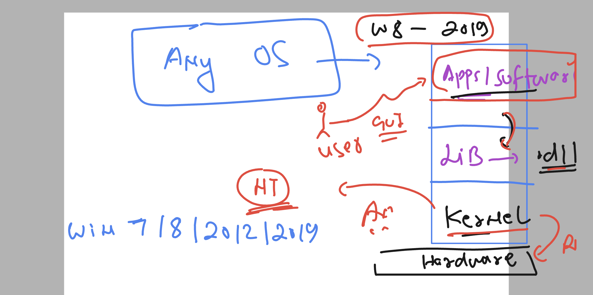
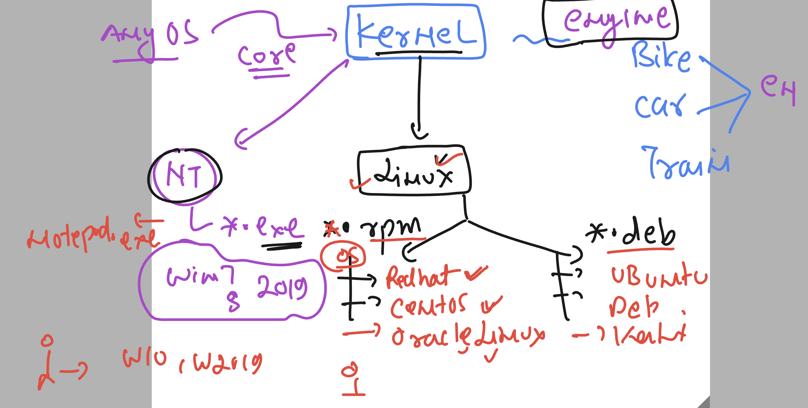
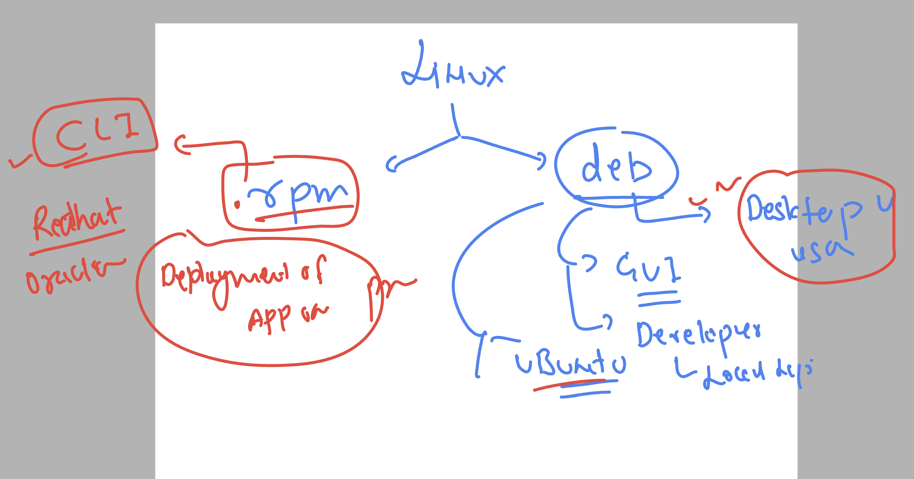
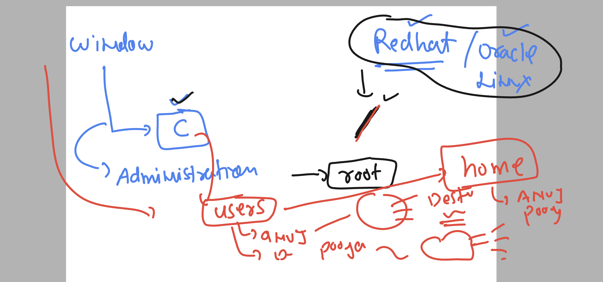
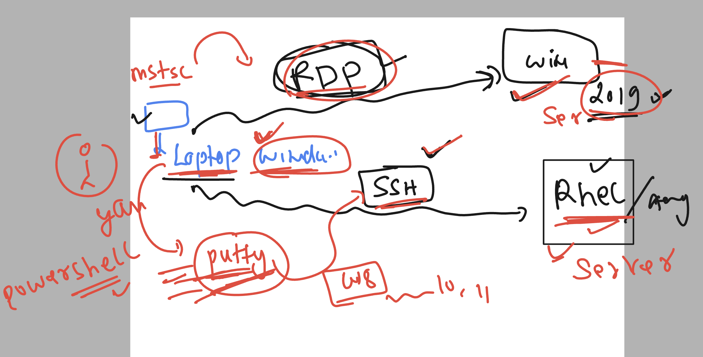
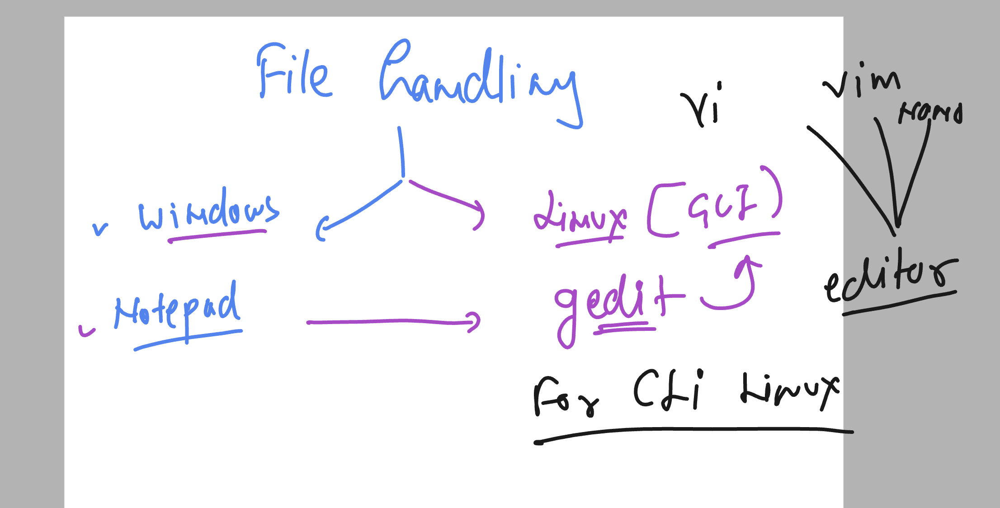
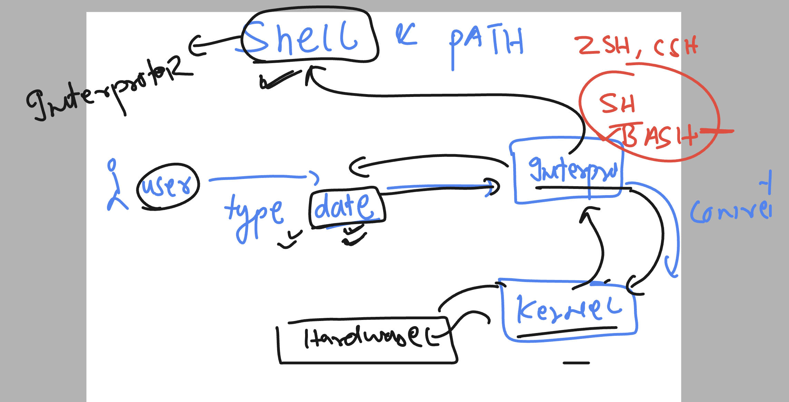
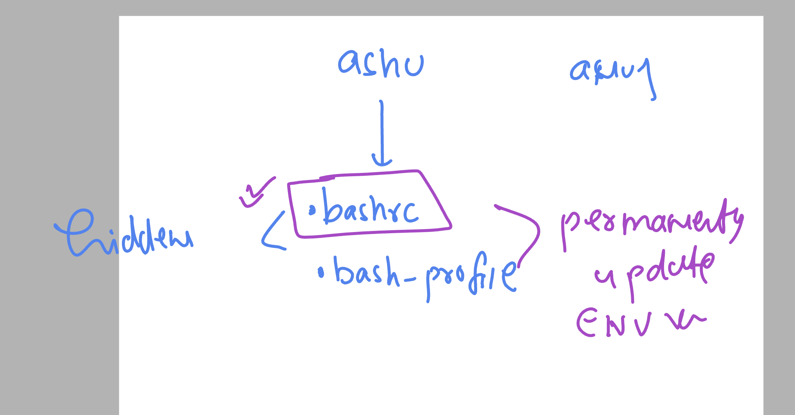
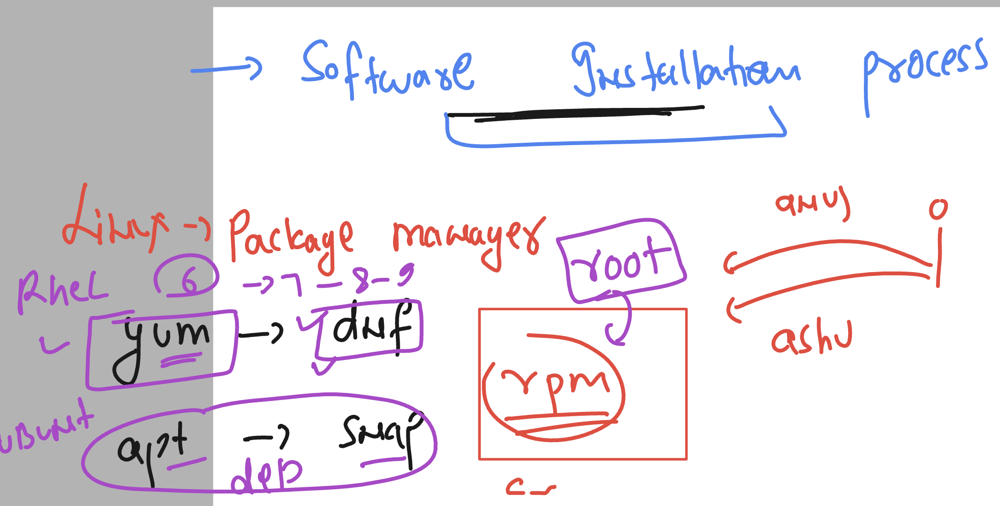

# linux-dotnet-vodafone

### Os component understanding 



### LInux as kernel 



### rpm vs deb 



### linux vs windows based directory system 



### lets get started with Redhat 8 

### from windows laptop to connect remote linux based server we gonna use ssh protocol



## lets get started with linux command line 

###  checking currently loggin username 

```
[ashu@linux-dotnet ~]$ whoami
ashu
```

### checking how many users are currently loggin

```
[ashu@linux-dotnet ~]$ who
opc      pts/0        2023-12-11 05:57 (27.58.5.47)
pooja    pts/1        2023-12-11 06:34 (103.132.30.64)
madhuri  pts/2        2023-12-11 06:34 (58.84.61.4)
anuj     pts/3        2023-12-11 06:40 (202.179.69.70)
ashu     pts/4        2023-12-11 06:43 (27.58.5.47)
vijay    pts/5        2023-12-11 06:41 (152.58.16.134)
shailesh pts/6        2023-12-11 06:44 (49.15.234.203)
vijay    pts/7        2023-12-11 06:46 (152.58.16.134)
```

## some basic commands 

### 

```
[ashu@linux-dotnet ~]$ date
Mon Dec 11 06:50:51 GMT 2023


[ashu@linux-dotnet ~]$
[ashu@linux-dotnet ~]$ cal
    December 2023
Su Mo Tu We Th Fr Sa
                1  2
 3  4  5  6  7  8  9
10 11 12 13 14 15 16
17 18 19 20 21 22 23
24 25 26 27 28 29 30
31


[ashu@linux-dotnet ~]$ cal  2023
                               2023

       January               February                 March
Su Mo Tu We Th Fr Sa   Su Mo Tu We Th Fr Sa   Su Mo Tu We Th Fr Sa
 1  2  3  4  5  6  7             1  2  3  4             1  2  3  4
 8  9 10 11 12 13 14    5  6  7  8  9 10 11    5  6  7  8  9 10 11
15 16 17 18 19 20 21   12 13 14 15 16 17 18   12 13 14 15 16 17 18
22 23 24 25 26 27 28   19 20 21 22 23 24 25   19 20 21 22 23 24 25
29 30 31               26 27 28               26 27 28 29 30 31


```

### checking particular month 

```

[ashu@linux-dotnet ~]$ cal 11  2023
    November 2023
Su Mo Tu We Th Fr Sa
          1  2  3  4
 5  6  7  8  9 10 11
12 13 14 15 16 17 18
19 20 21 22 23 24 25
26 27 28 29 30

[ashu@linux-dotnet ~]$ cal 11  2024
    November 2024
Su Mo Tu We Th Fr Sa
                1  2
 3  4  5  6  7  8  9
10 11 12 13 14 15 16
17 18 19 20 21 22 23
24 25 26 27 28 29 30
```

## Directory structure 

```
[ashu@linux-dotnet ~]$ whoami
ashu
[ashu@linux-dotnet ~]$ pwd
/home/ashu
[ashu@linux-dotnet ~]$
[ashu@linux-dotnet ~]$
[ashu@linux-dotnet ~]$ cd     /
[ashu@linux-dotnet /]$ pwd
/
[ashu@linux-dotnet /]$ ls
bin  boot  dev  etc  home  lib  lib64  media  mnt  opt  proc  root  run  sbin  srv  sys  tmp  usr  var
[ashu@linux-dotnet /]$
```

### creating directory under current user home directory 

```
[ashu@linux-dotnet ~]$ whoami
ashu
[ashu@linux-dotnet ~]$ pwd
/home/ashu
[ashu@linux-dotnet ~]$ mkdir hello
[ashu@linux-dotnet ~]$ ls
hello  learn  Library
[ashu@linux-dotnet ~]$ mkdir  a b c e
[ashu@linux-dotnet ~]$ ls
a  b  c  e  hello  learn  Library
[ashu@linux-dotnet ~]$
```

### removing directory 

```
[ashu@linux-dotnet home]$ pwd
/home
[ashu@linux-dotnet home]$ cd  ~
[ashu@linux-dotnet ~]$ pwd
/home/ashu
[ashu@linux-dotnet ~]$ ls
a  b  c  e  hello  learn  Library
[ashu@linux-dotnet ~]$ rmdir  hello
[ashu@linux-dotnet ~]$ ls
a  b  c  e  learn  Library
[ashu@linux-dotnet ~]$

```

### task1 solution 

```
 mkdir -p  a/b/d  a/c/e
[ashu@linux-dotnet ~]$
[ashu@linux-dotnet ~]$ ls
a  learn  Library
[ashu@linux-dotnet ~]$ ls  a
b  c
[ashu@linux-dotnet ~]$ ls  a/b
d
[ashu@linux-dotnet ~]$ ls  a/c
e
```

### removing a non empty directory 

```
[ashu@linux-dotnet ~]$ ls
a  learn  Library
[ashu@linux-dotnet ~]$ rmdir a
rmdir: failed to remove 'a': Directory not empty
[ashu@linux-dotnet ~]$
[ashu@linux-dotnet ~]$
[ashu@linux-dotnet ~]$ rm -r a
[ashu@linux-dotnet ~]$ ls
learn  Library
```

### using tree command to see entire structure of a directory 

```
 mkdir  -p   a/{b/d,c/e}
[ashu@linux-dotnet ~]$
[ashu@linux-dotnet ~]$ ls
a  learn  Library
[ashu@linux-dotnet ~]$ ls  a
b  c
[ashu@linux-dotnet ~]$ ls  a/b
d
[ashu@linux-dotnet ~]$ ls  a/c
e
[ashu@linux-dotnet ~]$
[ashu@linux-dotnet ~]$ ls
a  learn  Library
[ashu@linux-dotnet ~]$ tree a
a
├── b
│   └── d
└── c
    └── e


4 directories, 0 files
[ashu@linux-dotnet ~]$ rm -r  a
[ashu@linux-dotnet ~]$ ls
learn  Library
```

## file handling 



### creating empty file only 

```
 whoami
ashu
[ashu@linux-dotnet ~]$ pwd
/home/ashu
[ashu@linux-dotnet ~]$ ls
[ashu@linux-dotnet ~]$ touch  ashu.txt
[ashu@linux-dotnet ~]$ ls
ashu.txt
[ashu@linux-dotnet ~]$ touch  a.txt  b.txt
[ashu@linux-dotnet ~]$ ls
ashu.txt  a.txt  b.txt
[ashu@linux-dotnet ~]$ rm  ashu.txt
[ashu@linux-dotnet ~]$ ls
a.txt  b.txt
[ashu@linux-dotnet ~]$ rm  *.txt
[ashu@linux-dotnet ~]$ ls
[ashu@linux-dotnet ~]$

```

### use verbose in rm 

```
$
[ashu@linux-dotnet ~]$ touch  a.txt  b.txt
[ashu@linux-dotnet ~]$
[ashu@linux-dotnet ~]$ rm  -v  *.txt
removed 'a.txt'
removed 'b.txt'
[ashu@linux-dotnet ~]$
```

### using nano to create and write data in file 

```

[ashu@linux-dotnet ~]$
[ashu@linux-dotnet ~]$ nano   ashu.txt
[ashu@linux-dotnet ~]$
[ashu@linux-dotnet ~]$
[ashu@linux-dotnet ~]$ ls
ashu.txt
[ashu@linux-dotnet ~]$ nano   ashu.txt
[ashu@linux-dotnet ~]$
[ashu@linux-dotnet ~]$ nano   ashu.txt
[ashu@linux-dotnet ~]$

### just read data from file

[ashu@linux-dotnet ~]$ cat  ashu.txt
hey guys i am writing the content here
hello world
okey google
[ashu@linux-dotnet ~]$


```


## copy using cp

```
[ashu@linux-dotnet ~]$ cp  hello.txt   ok.txt
[ashu@linux-dotnet ~]$ ls
hello.txt  ok.txt
[ashu@linux-dotnet ~]$ cat  ok.txt
hello world this is vim text editor
hey there
ok fine
[ashu@linux-dotnet ~]$
[ashu@linux-dotnet ~]$ cat  hello.txt
hello world this is vim text editor
hey there
ok fine
[ashu@linux-dotnet ~]$ ls
hello.txt  ok.txt
[ashu@linux-dotnet ~]$ mkdir  hello
[ashu@linux-dotnet ~]$ ls
hello  hello.txt  ok.txt
[ashu@linux-dotnet ~]$ cp ok.txt   hello
[ashu@linux-dotnet ~]$ ls
hello  hello.txt  ok.txt
[ashu@linux-dotnet ~]$ cp  -r  hello    newdir
[ashu@linux-dotnet ~]$ ls
hello  hello.txt  newdir  ok.txt
```

### rename 

```
 mv  ok.txt   ashu.txt
[ashu@linux-dotnet ~]$ ls
ashu.txt  hello  hello.txt  newdir
[ashu@linux-dotnet ~]$
```

### searching data 

```
 find  /  -name  hello.txt  2>/dev/null
/home/ashu/hello.txt
/tmp/hello.txt
[ashu@linux-dotnet ~]$
[ashu@linux-dotnet ~]$
[ashu@linux-dotnet ~]$ find  /  -name  hello  2>/dev/null
/home/ashu/hello
/tmp/hello
[ashu@linux-dotnet ~]$ find  / -type d  -name  hello  2>/dev/null
/home/ashu/hello
/tmp/hello
```

###  2>/dev/null is error redirection 

### checking file and directory size

```
 ls  -l  hello.txt
-rw-rw-r--. 1 ashu ashu 2817941490 Dec 11 09:27 hello.txt
[ashu@linux-dotnet ~]$
[ashu@linux-dotnet ~]$
[ashu@linux-dotnet ~]$ ls  -lh  hello.txt
-rw-rw-r--. 1 ashu ashu 2.7G Dec 11 09:27 hello.txt
[ashu@linux-dotnet ~]$
[ashu@linux-dotnet ~]$
[ashu@linux-dotnet ~]$ ls  -ld   hello
drwxrwxr-x. 2 ashu ashu 20 Dec 11 09:17 hello
[ashu@linux-dotnet ~]$
[ashu@linux-dotnet ~]$ ls  -lhd   hello
drwxrwxr-x. 2 ashu ashu 20 Dec 11 09:17 hello
[ashu@linux-dotnet ~]$

```

### checking stat

```
 stat   hello.txt
  File: hello.txt
  Size: 2817941490      Blocks: 5503792    IO Block: 4096   regular file
Device: fc00h/64512d    Inode: 101243405   Links: 1
Access: (0664/-rw-rw-r--)  Uid: ( 1001/    ashu)   Gid: ( 1001/    ashu)
Context: unconfined_u:object_r:user_home_t:s0
Access: 2023-12-11 09:28:28.821181205 +0000
Modify: 2023-12-11 09:27:24.324907322 +0000
Change: 2023-12-11 09:27:24.324907322 +0000
 Birth: 2023-12-11 09:15:58.201967227 +0000
[ashu@linux-dotnet ~]$
```

### intro to shell -- an interface between user and kernel 



### checkking all available shell in linux based os

```
 cat   /etc/shells
/bin/sh
/bin/bash
/usr/bin/sh
/usr/bin/bash
```

### checking current shell

```

[ashu@linux-dotnet ~]$ ksfjkldsjf
-bash: ksfjkldsjf: command not found
[ashu@linux-dotnet ~]$
[ashu@linux-dotnet ~]$
[ashu@linux-dotnet ~]$ echo hello
hello
[ashu@linux-dotnet ~]$ echo 100
100
[ashu@linux-dotnet ~]$ echo  $SHELL
/bin/bash
[ashu@linux-dotnet ~]$ skdfjldsjf
-bash: skdfjldsjf: command not found
[ashu@linux-dotnet ~]$
```

### 

```

[ashu@linux-dotnet ~]$ echo  $USER
ashu
[ashu@linux-dotnet ~]$ echo  $LANG
en_US.UTF-8
```

### printing all environment variables 

```
 env
LS_COLORS=rs=0:di=38;5;33:ln=38;5;51:mh=00:pi=40;38;5;11:so=38;5;13:do=38;5;5:bd=48;5;232;38;5;11:cd=48;5;232;38;5;3:or=48;5;232;38;5;9:mi=01;05;37;41:su=48;5;196;38;5;15:sg=48;5;11;38;5;16:ca=48;5;196;38;5;226:tw=48;5;10;38;5;16:ow=48;5;10;38;5;21:st=48;5;21;38;5;15:ex=38;5;40:*.tar=38;5;9:*.tgz=38;5;9:*.arc=38;5;9:*.arj=38;5;9:*.taz=38;5;9:*.lha=38;5;9:*.lz4=38;5;9:*.lzh=38;5;9:*.lzma=38;5;9:*.tlz=38;5;9:*.txz=38;5;9:*.tzo=38;5;9:*.t7z=38;5;9:*.zip=38;5;9:*.z=38;5;9:*.dz=38;5;9:*.gz=38;5;9:*.lrz=38;5;9:*.lz=38;5;9:*.lzo=38;5;9:*.xz=38;5;9:*.zst=38;5;9:*.tzst=38;5;9:*.bz2=38;5;9:*.bz=38;5;9:*.tbz=38;5;9:*.tbz2=38;5;9:*.tz=38;5;9:*.deb=38;5;9:*.rpm=38;5;9:*.jar=38;5;9:*.war=38;5;9:*.ear=38;5;9:*.sar=38;5;9:*.rar=38;5;9:*.alz=38;5;9:*.ace=38;5;9:*.zoo=38;5;9:*.cpio=38;5;9:*.7z=38;5;9:*.rz=38;5;9:*.cab=38;5;9:*.wim=38;5;9:*.swm=38;5;9:*.dwm=38;5;9:*.esd=38;5;9:*.jpg=38;5;13:*.jpeg=38;5;13:*.mjpg=38;5;13:*.mjpeg=38;5;13:*.gif=38;5;13:*.bmp=38;5;13:*.pbm=38;5;13:*.pgm=38;5;13:*.ppm=38;5;13:*.tga=38;5;13:*.xbm=38;5;13:*.xpm=38;5;13:*.tif=38;5;13:*.tiff=38;5;13:*.png=38;5;13:*.svg=38;5;13:*.svgz=38;5;13:*.mng=38;5;13:*.pcx=38;5;13:*.mov=38;5;13:*.mpg=38;5;13:*.mpeg=38;5;13:*.m2v=38;5;13:*.mkv=38;5;13:*.webm=38;5;13:*.ogm=38;5;13:*.mp4=38;5;13:*.m4v=38;5;13:*.mp4v=38;5;13:*.vob=38;5;13:*.qt=38;5;13:*.nuv=38;5;13:*.wmv=38;5;13:*.asf=38;5;13:*.rm=38;5;13:*.rmvb=38;5;13:*.flc=38;5;13:*.avi=38;5;13:*.fli=38;5;13:*.flv=38;5;13:*.gl=38;5;13:*.dl=38;5;13:*.xcf=38;5;13:*.xwd=38;5;13:*.yuv=38;5;13:*.cgm=38;5;13:*.emf=38;5;13:*.ogv=38;5;13:*.ogx=38;5;13:*.aac=38;5;45:*.au=38;5;45:*.flac=38;5;45:*.m4a=38;5;45:*.mid=38;5;45:*.midi=38;5;45:*.mka=38;5;45:*.mp3=38;5;45:*.mpc=38;5;45:*.ogg=38;5;45:*.ra=38;5;45:*.wav=38;5;45:*.oga=38;5;45:*.opus=38;5;45:*.spx=38;5;45:*.xspf=38;5;45:
SSH_CONNECTION=223.235.205.67 53007 10.0.0.57 22
MODULES_RUN_QUARANTINE=LD_LIBRARY_PATH LD_PRELOAD
LANG=en_US.UTF-8
HISTCONTROL=ignoredups
HOSTNAME=linux-dotnet
DOTNET_ROOT=/usr/lib64/dotnet
S_COLORS=auto
which_declare=declare -f
XDG_SESSION_ID=41
MODULES_CMD=/usr/share/Modules/libexec/modulecmd.tcl
DOTNET_BUNDLE_EXTRACT_BASE_DIR=/home/ashu/.cache/dotnet_bundle_extract
USER=ashu
SELINUX_ROLE_REQUESTED=
PWD=/home/ashu
HOME=/home/ashu
SSH_CLIENT=223.235.205.67 53007 22
SELINUX_LEVEL_REQUESTED=
LOADEDMODULES=
SSH_TTY=/dev/pts/8
MAIL=/var/spool/mail/ashu
TERM=xterm-256color
SHELL=/bin/bash
SELINUX_USE_CURRENT_RANGE=
SHLVL=1
MANPATH=:
MODULEPATH=/etc/scl/modulefiles:/usr/share/Modules/modulefiles:/etc/modulefiles:/usr/share/modulefiles
LOGNAME=ashu
```

### checking PATH variable 

```

[ashu@linux-dotnet ~]$ echo $PATH
/home/ashu/.local/bin:/home/ashu/bin:/usr/share/Modules/bin:/usr/local/bin:/usr/bin:/usr/local/sbin:/usr/sbin:/home/ashu/.dotnet/tools
[ashu@linux-dotnet ~]$
[ashu@linux-dotnet ~]$
[ashu@linux-dotnet ~]$
[ashu@linux-dotnet ~]$ which date
/usr/bin/date
[ashu@linux-dotnet ~]$ which cal
/usr/bin/cal
[ashu@linux-dotnet ~]$
```

### adding location into the PATH variable 

```
PATH=$PATH:/home/ashu/data
[ashu@linux-dotnet ~]$
[ashu@linux-dotnet ~]$ echo $PATH
/home/ashu/.local/bin:/home/ashu/bin:/usr/share/Modules/bin:/usr/local/bin:/usr/bin:/usr/local/sbin:/usr/sbin:/home/ashu/.dotnet/tools:/home/ashu/data
[ashu@linux-dotnet ~]$ date
Mon Dec 11 09:54:01 GMT 2023
```

### ENV variable with each user setting 



```
 whoami
ashu
[ashu@linux-dotnet ~]$ pwd
/home/ashu
[ashu@linux-dotnet ~]$ ls
ashu.txt  hello  hello.txt  newdir
[ashu@linux-dotnet ~]$
[ashu@linux-dotnet ~]$
[ashu@linux-dotnet ~]$ ls   -a
.   ashu.txt       .bash_logout   .bashrc  .dotnet  hello.txt  .mono   .nuget       .templateengine  .vscode-server
..  .bash_history  .bash_profile  .cache   hello    .local     newdir  .ServiceHub  .viminfo         .wget-hsts
[ashu@linux-dotnet ~]$

```


### .bashrc file to update ENV 

```

[ashu@linux-dotnet ~]$ nano  .bashrc
[ashu@linux-dotnet ~]$ cat  .bashrc
# .bashrc

# Source global definitions
if [ -f /etc/bashrc ]; then
        . /etc/bashrc
fi

# User specific environment
if ! [[ "$PATH" =~ "$HOME/.local/bin:$HOME/bin:" ]]
then
    PATH="$HOME/.local/bin:$HOME/bin:$PATH"
fi

PATH=$PATH:/home/ashu/command
export PATH

x=999

# Uncomment the following line if you don't like systemctl's auto-paging feature:
# export SYSTEMD_PAGER=

```

### to update logout and login

```
201 closed.
PS C:\Users\humanfirmware> ssh  ashu@144.24.123.201
ashu@144.24.123.201's password:
Activate the web console with: systemctl enable --now cockpit.socket

Last login: Mon Dec 11 09:52:58 2023 from 223.235.205.67
[ashu@linux-dotnet ~]$
[ashu@linux-dotnet ~]$ echo $x
999
[ashu@linux-dotnet ~]$ echo $PATH
/home/ashu/.local/bin:/home/ashu/bin:/usr/share/Modules/bin:/usr/local/bin:/usr/bin:/usr/local/sbin:/usr/sbin:/home/ashu/.dotnet/tools:/home/ashu/command
```

# OR --- user source command to update

```
 vim .bashrc
[ashu@linux-dotnet ~]$
[ashu@linux-dotnet ~]$ cat .bashrc
# .bashrc

# Source global definitions
if [ -f /etc/bashrc ]; then
        . /etc/bashrc
fi

# User specific environment
if ! [[ "$PATH" =~ "$HOME/.local/bin:$HOME/bin:" ]]
then
    PATH="$HOME/.local/bin:$HOME/bin:$PATH"
fi

PATH=$PATH:/home/ashu/command
export PATH

x=2000

# Uncomment the following line if you don't like systemctl's auto-paging feature:
# export SYSTEMD_PAGER=

# User specific aliases and functions
[ashu@linux-dotnet ~]$
[ashu@linux-dotnet ~]$
[ashu@linux-dotnet ~]$ echo $x
999
[ashu@linux-dotnet ~]$
[ashu@linux-dotnet ~]$ source  .bashrc
[ashu@linux-dotnet ~]$
[ashu@linux-dotnet ~]$ echo $x
2000
```

## Alias in shell

```
$
[ashu@linux-dotnet ~]$
[ashu@linux-dotnet ~]$ alias   d=date


[ashu@linux-dotnet ~]$ d
Mon Dec 11 10:20:18 GMT 2023
[ashu@linux-dotnet ~]$
[ashu@linux-dotnet ~]$

[ashu@linux-dotnet ~]$ date
Mon Dec 11 10:20:25 GMT 2023
[ashu@linux-dotnet ~]$

====>>

[ashu@linux-dotnet ~]$ alias  year='date +%Y'
[ashu@linux-dotnet ~]$ year
2023
[ashu@linux-dotnet ~]$


```

### making rm command interactive 

```

[ashu@linux-dotnet ~]$ cat  .bashrc
# .bashrc

# Source global definitions
if [ -f /etc/bashrc ]; then
        . /etc/bashrc
fi

# User specific environment
if ! [[ "$PATH" =~ "$HOME/.local/bin:$HOME/bin:" ]]
then
    PATH="$HOME/.local/bin:$HOME/bin:$PATH"
fi

PATH=$PATH:/home/ashu/command
export PATH


# Uncomment the following line if you don't like systemctl's auto-paging feature:
# export SYSTEMD_PAGER=

# User specific aliases and functions

alias  year='date +%Y'
alias  d='date'
alias  rm='rm -i'
```

### testing it 

```
 source  .bashrc
[ashu@linux-dotnet ~]$
[ashu@linux-dotnet ~]$ ls
ashu.txt  hello  newdir
[ashu@linux-dotnet ~]$ rm  ashu.txt
rm: remove regular file 'ashu.txt'? n


[ashu@linux-dotnet ~]$ ls
ashu.txt  hello  newdir
[ashu@linux-dotnet ~]$

[ashu@linux-dotnet ~]$ rm  ashu.txt
rm: remove regular file 'ashu.txt'? y
[ashu@linux-dotnet ~]$ ls
hello  newdir
```
## software installation or package management in linux 



### trying with normal user

```

[ashu@linux-dotnet ~]$
[ashu@linux-dotnet ~]$ yum  install  telnet
Error: This command has to be run with superuser privileges (under the root user on most systems).
[ashu@linux-dotnet ~]$
[ashu@linux-dotnet ~]$
[ashu@linux-dotnet ~]$ dnf  install  telnet
Error: This command has to be run with superuser privileges (under the root user on most systems).
[ashu@linux-dotnet ~]$

```

### as root user we can install software 

```
whoami
root
[root@linux-dotnet ~]# yum  install telnet 
Last metadata expiration check: 2:38:25 ago on Mon 11 Dec 2023 08:03:58 AM GMT.
Dependencies resolved.
============================================================================================================================
 Package                  Architecture              Version                           Repository                       Size
============================================================================================================================
Installing:
 telnet                   aarch64                   1:0.17-76.el8                     ol8_appstream                    70 k

Transaction Summary
============================================================================================================================
Install  1 Package

Total download size: 70 k
Installed size: 154 k
Is this ok [y/N]: n
Operation aborted.
[root@linux-dotnet ~]# 
[root@linux-dotnet ~]# dnf   install telnet 
Last metadata expiration check: 2:38:48 ago on Mon 11 Dec 2023 08:03:58 AM GMT.
Dependencies resolved.
============================================================================================================================
 Package                  Architecture              Version                           Repository                       Size
============================================================================================================================
Installing:
 telnet                   aarch64                   1:0.17-76.el8                     ol8_appstream                    70 k

Transaction Summary
============================================================================================================================
Install  1 Package

Total download size: 70 k
Installed size: 154 k
Is this ok [y/N]: y
Downloading Packages:
telnet-0.17-76.el8.aarch64.rpm                                                              2.0 MB/s |  70 kB     00:00    
----------------------------------------------------------------------------------------------------------------------------
Total                                                                                       1.9 MB/s |  70 kB     00:00     
Running transaction check
Transaction check succeeded.
Running transaction test
Transaction test succeeded.
Running transaction
  Preparing        :                                                                                                    1/1 
  Installing       : telnet-1:0.17-76.el8.aarch64                                                                       1/1 
  Running scriptlet: telnet-1:0.17-76.el8.aarch64               
```

### as non root user we can check these details 

```
 rpm  -q  telnet
telnet-0.17-76.el8.aarch64
[ashu@linux-dotnet ~]$
[ashu@linux-dotnet ~]$ rpm  -q -i  telnet
Name        : telnet
Epoch       : 1
Version     : 0.17
Release     : 76.el8
Architecture: aarch64
Install Date: Mon 11 Dec 2023 10:42:51 AM GMT
Group       : Applications/Internet
Size        : 157896
License     : BSD
Signature   : RSA/SHA256, Wed 07 Apr 2021 11:37:20 AM GMT, Key ID 82562ea9ad986da3
Source RPM  : telnet-0.17-76.el8.src.rpm
Build Date  : Wed 07 Apr 2021 11:36:49 AM GMT
Build Host  : ca-buildarm06.us.oracle.com
Relocations : (not relocatable)
Vendor      : Oracle America
URL         : http://web.archive.org/web/20070819111735/www.hc
```

### uninstall software as root user 

```
yum remove  telnet 
Dependencies resolved.
============================================================================================================================
 Package                  Architecture              Version                          Repository                        Size
============================================================================================================================
Removing:
 telnet                   aarch64                   1:0.17-76.el8                    @ol8_appstream                   154 k

Transaction Summary
============================================================================================================================
Remove  1 Package

Freed space: 154 k
Is this ok [y/N]: y
Running transaction check
Transaction check succeeded.
Running transaction test
Transaction test succeeded.
Running transaction
  Preparing        :                                                                                                    1/1 
  Erasing          : telnet-1:0.17-76.el8.aarch64                                                                       1/1 
  Running scriptlet: telnet-1:0.17-76.el8.aarch64                                                                       1/1 
  Verifying        : telnet-1:0.17-76.el8.aarch64                                                                       1/1 

Removed:
  telnet-1:0.17-76.el8.aarch64                                                                                              

Complete!
[root@linux-dotnet ~]# 

```


