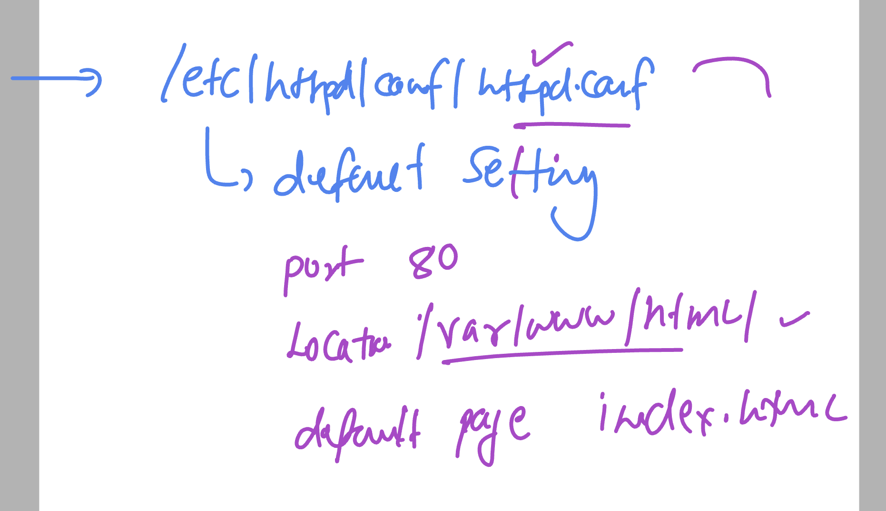

### today target 


## linux revision 1 


### linux directory structure 


### sudo permission 


### Concept of VM 


### public cloud options in market


## lets check now the server details on centos 

```
[opc@ashu-linux-vm ~]$ hostname
ashu-linux-vm

[opc@ashu-linux-vm ~]$ whoami
opc

[opc@ashu-linux-vm ~]$ pwd
/home/opc
[opc@ashu-linux-vm ~]$ ls  /
bin  boot  dev  etc  home  lib  lib64  media  mnt  opt  proc  root  run  sbin  srv  sys  tmp  usr  var
[opc@ashu-linux-vm ~]$ 

```

## Deploying html sample app to centos / rhel 8 using apache httpd webapp server

### installing httpd 

```
[opc@ashu-linux-vm ~]$ sudo dnf install httpd
Failed loading plugin "osmsplugin": No module named 'librepo'
CentOS Stream 8 - AppStream                                                                               17 MB/s |  35 MB     00:02    
CentOS Stream 8 - BaseOS                                                                                  21 MB/s |  56 MB     00:02    
CentOS Stream 8 - Extras                                                                                  18 kB/s |  18 kB     00:00    
CentOS Stream 8 - Extras common packages                                                                  20 kB/s | 6.9 kB     00:00    
Extra Packages for Enterprise Linux 8 - x86_64    32% [===============                                 ] 130 kB/s | 5.1 MB     01:25 ETA


```

### verify installation and checking version 

```
[opc@ashu-linux-vm ~]$ rpm -q  httpd
httpd-2.4.37-62.module_el8+657+88b2113f.x86_64
[opc@ashu-linux-vm ~]$


[opc@ashu-linux-vm ~]$ rpm -qi  httpd
Name        : httpd
Version     : 2.4.37
Release     : 62.module_el8+657+88b2113f
Architecture: x86_64
Install Date: Tue Dec 12 06:29:15 2023
Group       : System Environment/Daemons
Size        : 4502883
License     : ASL 2.0

```

### Note: to see all the software installed 

```
 rpm  -qa 
kpatch-0.9.7-2.el8.noarch
coreutils-8.30-15.el8.x86_64
fontpackages-filesystem-1.44-22.el8.noarch
sssd-kcm-2.9.2-1.el8.x86_64
device-mapper-libs-1.02.181-9.el8.x86_64
libreport-filesystem-2.9.5-15.el8.x86_64
wget-1.19.5-11.el8.x86_64
libdb-5.3.28-42.el8_4.x86_64
abattis-cantarell-fonts-0.0.25-6.el8.noarch
```

### checking all configuration files created by httpd on linux server

```
opc@ashu-linux-vm ~]$ rpm -qc  httpd
/etc/httpd/conf.d/autoindex.conf
/etc/httpd/conf.d/userdir.conf
/etc/httpd/conf.d/welcome.conf
/etc/httpd/conf.modules.d/00-base.conf
/etc/httpd/conf.modules.d/00-dav.conf
/etc/httpd/conf.modules.d/00-lua.conf
/etc/httpd/conf.modules.d/00-mpm.conf
/etc/httpd/conf.modules.d/00-optional.conf
/etc/httpd/conf.modules.d/00-proxy.conf
/etc/httpd/conf.modules.d/00-systemd.conf
/etc/httpd/conf.modules.d/01-cgi.conf
/etc/httpd/conf/httpd.conf
/etc/httpd/conf/magic
/etc/logrotate.d/httpd
/etc/sysconfig/htcacheclean

```

### locating main config file of apache httpd server 

```
 cd  /etc/httpd/
[opc@ashu-linux-vm httpd]$ ls
conf  conf.d  conf.modules.d  logs  modules  run  state
[opc@ashu-linux-vm httpd]$ cd  conf
[opc@ashu-linux-vm conf]$ ls
httpd.conf  magic

```

### default httpd setting 



### lets use sample github page 

```
[opc@ashu-linux-vm html]$ cd  ~
[opc@ashu-linux-vm ~]$ ls
[opc@ashu-linux-vm ~]$ 
[opc@ashu-linux-vm ~]$ git  clone  https://github.com/schoolofdevops/html-sample-app.git
-bash: git: command not found
[opc@ashu-linux-vm ~]$ 
[opc@ashu-linux-vm ~]$ sudo dnf  install git 
Failed loading plugin "osmsplugin": No module named 'librepo'
Last metadata expiration check: 0:32:27 ago on Tue 12 Dec 2023 06:31:55 AM GMT.
Dependencies resolved.
=========================================================================================================================================
 Package                             Architecture        Version                                            Repository              Size
=========================================================================================================================================
Installing:
 git                                 x86_64         
```

### cloning html sample code from github 

```
git  clone  https://github.com/schoolofdevops/html-sample-app.git
Cloning into 'html-sample-app'...
remote: Enumerating objects: 74, done.
remote: Counting objects: 100% (2/2), done.
remote: Compressing objects: 100% (2/2), done.
remote: Total 74 (delta 0), reused 0 (delta 0), pack-reused 72
Receiving objects: 100% (74/74), 1.38 MiB | 595.00 KiB/s, done.
Resolving deltas: 100% (5/5), done.
[opc@ashu-linux-vm ~]$ ls
html-sample-app
[opc@ashu-linux-vm ~]$ ls html-sample-app/
LICENSE.txt  README.txt  assets  elements.html  generic.html  html5up-phantom.zip  images  index.html
[opc@ashu-linux-vm ~]$ 

```

### verify code sample project

```
[opc@ashu-linux-vm ~]$ ls
html-sample-app  project-html-website
[opc@ashu-linux-vm ~]$ ls  html-sample-app/
LICENSE.txt  README.txt  assets  elements.html  generic.html  html5up-phantom.zip  images  index.html
[opc@ashu-linux-vm ~]$ 
[opc@ashu-linux-vm ~]$ 
[opc@ashu-linux-vm ~]$ 
[opc@ashu-linux-vm ~]$ ls  project-html-website/
LICENSE  README.md  SECURITY.md  css  fonts  img  index.html
[opc@ashu-linux-vm ~]$ 
[opc@ashu-linux-vm ~]$ 

```

### copy code to /var/www/html/

```
[opc@ashu-linux-vm ~]$ ls
html-sample-app  project-html-website
[opc@ashu-linux-vm ~]$ ls  html-sample-app/
LICENSE.txt  README.txt  assets  elements.html  generic.html  html5up-phantom.zip  images  index.html
[opc@ashu-linux-vm ~]$ 
[opc@ashu-linux-vm ~]$ 
[opc@ashu-linux-vm ~]$ sudo  cp -rf  html-sample-app/*   /var/www/html/
[opc@ashu-linux-vm ~]$ cd  /var/www/html/
[opc@ashu-linux-vm html]$ ls
LICENSE.txt  README.txt  assets  elements.html  generic.html  html5up-phantom.zip  images  index.html
[opc@ashu-linux-vm html]$ 


```

### starting service of httpd server

```
sudo  systemctl  start httpd
[opc@ashu-linux-vm ~]$ sudo  systemctl  status httpd
● httpd.service - The Apache HTTP Server
   Loaded: loaded (/usr/lib/systemd/system/httpd.service; disabled; vendor preset: disabled)
   Active: active (running) since Tue 2023-12-12 07:19:55 GMT; 3s ago
     Docs: man:httpd.service(8)
 Main PID: 34359 (httpd)
   Status: "Started, listening on: port 80"
    Tasks: 213 (limit: 22608)
   Memory: 17.5M
   CGroup: /system.slice/httpd.service
           ├─34359 /usr/sbin/httpd -DFOREGROUND
           ├─34360 /usr/sbin/httpd -DFOREGROUND
           ├─34361 /usr/sbin/httpd -DFOREGROUND
           ├─34362 /usr/sbin/httpd -DFOREGROUND
           └─34363 /usr/sbin/httpd -DFOREGROUND

Dec 12 07:19:55 ashu-linux-vm systemd[1]: Starting The Apache HTTP Server...
Dec 12 07:19:55 ashu-linux-vm systemd[1]: Started The Apache HTTP Server.
Dec 12 07:19:55 ashu-linux-vm httpd[34359]: Server configured, listening on: port 80
[opc@ashu-linux-vm ~]$ 

```

### optional step -- to set auto-start on server rebot 

```
sudo  systemctl enable  httpd
Created symlink /etc/systemd/system/multi-user.target.wants/httpd.service → /usr/lib/systemd/system/httpd.service.
[opc@ashu-linux-vm ~]$ 

```

### page is not loading due to OS / server internal firewall 


### checking firewalld

```
sudo systemctl status  firewalld
● firewalld.service - firewalld - dynamic firewall daemon
   Loaded: loaded (/usr/lib/systemd/system/firewalld.service; enabled; vendor preset: enabled)
   Active: active (running) since Tue 2023-12-12 06:07:12 GMT; 1h 25min ago
     Docs: man:firewalld(1)
 Main PID: 1069 (firewalld)
    Tasks: 2 (limit: 22608)
   Memory: 29.6M

```

### checking rules and allow http connection 

```

[opc@ashu-linux-vm ~]$ sudo  firewall-cmd  --list-service
cockpit dhcpv6-client ssh
[opc@ashu-linux-vm ~]$ 
[opc@ashu-linux-vm ~]$ sudo  firewall-cmd  --add-service=http 
success
[opc@ashu-linux-vm ~]$ sudo  firewall-cmd  --add-service=http --permanent 
success
[opc@ashu-linux-vm ~]$ sudo  firewall-cmd  --list-service
cockpit dhcpv6-client http ssh
[opc@ashu-linux-vm ~]$ 

```

## COncept of VirtualHosting 


### More closure 


### creating virtualhost 

```
[opc@ashu-linux-vm conf.d]$ pwd
/etc/httpd/conf.d
```

### default.conf 

```
cat  default.conf 
<virtualhost *:80>

</virtualhost>

```

### adding two virutalhost 

```
[opc@ashu-linux-vm conf.d]$ ls
README  ashu-adhoc.conf  ashu-delvex.conf  autoindex.conf  default.conf  userdir.conf  welcome.conf
[opc@ashu-linux-vm conf.d]$ cat  default.conf 
<virtualhost *:80>
	servername 152.67.9.194
	documentroot /var/www/html/
</virtualhost>

[opc@ashu-linux-vm conf.d]$ 
[opc@ashu-linux-vm conf.d]$ cat  ashu-adhoc.conf 
<virtualhost *:80>
	servername ashu.adhocnet.org
	documentroot /var/www/adhoc/
</virtualhost>


[opc@ashu-linux-vm conf.d]$ 
[opc@ashu-linux-vm conf.d]$ 
[opc@ashu-linux-vm conf.d]$ cat  ashu-delvex.conf 
<virtualhost *:80>
	servername ashu.delvex.io
	documentroot /var/www/delvex/
</virtualhost>


[opc@ashu-linux-vm conf.d]$ cd  /var/www/
[opc@ashu-linux-vm www]$ ls
cgi-bin  html
[opc@ashu-linux-vm www]$ sudo mkdir  adhoc delvex
[opc@ashu-linux-vm www]$ ls
adhoc  cgi-bin  delvex  html

[opc@ashu-linux-vm www]$ cd  adhoc/
[opc@ashu-linux-vm adhoc]$ ls
[opc@ashu-linux-vm adhoc]$ sudo vim  index.html 
[opc@ashu-linux-vm adhoc]$ cat index.html 
<h1> Hello adhoc </h1>

[opc@ashu-linux-vm adhoc]$ cd ../delvex/
[opc@ashu-linux-vm delvex]$ sudo vim  index.html 
[opc@ashu-linux-vm delvex]$ cat index.html 
<h1> hello Delvex welcome to linux vhosting </h1>
[opc@ashu-linux-vm delvex]$ 

```


### incase we want to test config changes before restarting service

```
 httpd  -t
Syntax OK

======>> OR 
[opc@ashu-linux-vm conf.d]$ apachectl configtest
Syntax OK
[opc@ashu-linux-vm conf.d]$ 


```

### lets restart service

```
[opc@ashu-linux-vm conf.d]$ sudo systemctl restart httpd
[opc@ashu-linux-vm conf.d]$ sudo systemctl status httpd
● httpd.service - The Apache HTTP Server
   Loaded: loaded (/usr/lib/systemd/system/httpd.service; enabled; vendor preset: disabled)
   Active: active (running) since Tue 2023-12-12 09:21:27 GMT; 4s ago
     Docs: man:httpd.service(8)
 Main PID: 36024 (httpd)
   Status: "Started, listening on: port 80"
    Tasks: 213 (limit: 22608)
   Memory: 17.6M
   CGroup: /system.slice/httpd.service
           ├─36024 /usr/sbin/httpd -DFOREGROUND

```

## Info about .net -- .net core 


### searching dotnet sdk and runtime support in RHEL 8 

```
sudo dnf  search dotnet
Failed loading plugin "osmsplugin": No module named 'librepo'
Last metadata expiration check: 0:10:10 ago on Tue 12 Dec 2023 11:11:27 AM GMT.
===================================================== Name Exactly Matched: dotnet ======================================================
dotnet.x86_64 : .NET CLI tools and runtime
========================================================= Name Matched: dotnet ==========================================================
dotnet-apphost-pack-3.0.x86_64 : Targeting Pack for Microsoft.NETCore.App 3.0
dotnet-apphost-pack-3.1.x86_64 : Targeting Pack for Microsoft.NETCore.App 3.1
dotnet-apphost-pack-5.0.x86_64 : Targeting Pack for Microsoft.NETCore.App 5.0
dotnet-apphost-pack-6.0.x86_64 : Targeting Pack for Microsoft.NETCore.App 6.0
dotnet-apphost-pack-7.0.x86_64 : Targeting Pack for Microsoft.NETCore.App 7.0
dotnet-apphost-pack-8.0.x86_64 : Targeting Pack for Microsoft.NETCore.App 8.0
dotnet-host.x86_64 : .NET command line launcher
dotnet-host-fxr-2.1.x86_64 : .NET Core command line host resolver
dotnet-hostfxr-3.0.x86_64 : .NET Core command line host resolver
dotnet-hostfxr-3.1.x86_64 : .NET Core command line host resolver
dotnet-hostfxr-5.0.x86_64 : .NET command line host resolver
dotnet-hostfxr-6.0.x86_64 : .NET command line host resolver
dotnet-hostfxr-7.0.x86_64 : .NET command line host resolver
dotnet-hostfxr-8.0.x86_64 : .NET command line host resolver
dotnet-runtime-2.1.x86_64 : NET Core 2.1 runtime
dotnet-runtime-3.0.x86_64 : NET Core 3.0 runtime
dotnet-runtime-3.1.x86_64 : NET Core 3.1 runtime
dotnet-runtime-5.0.x86_64 : NET 5.0 runtime
dotnet-runtime-6.0.x86_64 : NET 6.0 runtime
dotnet-runtime-7.0.x86_64 : NET 7.0 runtime
dotnet-runtime-8.0.x86_64 : NET 8.0 runtime
dotnet-sdk-2.1.x86_64 : .NET Core 2.1 Software Development Kit
dotnet-sdk-2.1.5xx.x86_64 : .NET Core 2.1.5xx Software Development Kit
dotnet-sdk-3.0.x86_64 : .NET Core 3.0 Software Development Kit
dotnet-sdk-3.1.x86_64 : .NET Core 3.1 Software Development Kit
dotnet-sdk-5.0.x86_64 : .NET 5.0 Software Development Kit
dotnet-sdk-6.0.x86_64 : .NET 6.0 Software Development Kit

```

### lets install net 8 

```
[opc@ashu-linux-vm delvex]$ sudo dnf  install dotnet-sdk-8.0
Failed loading plugin "osmsplugin": No module named 'librepo'
Last metadata expiration check: 0:12:50 ago on Tue 12 Dec 2023 11:11:27 AM GMT.
Dependencies resolved.
=========================================================================================================================================
 Package                                       Architecture          Version                              Repository                Size
=========================================================================================================================================
Installing:
 dotnet-sdk-8.0                                x86_64                8.0.100~rc.2-0.2.el8                 appstream                121 M
Installing dependencies:
 aspnetcore-runtime-8.0                        x86_64                8.0.0~rc.2-0.2.el8                   appstream                8.0 M
 aspnetcore-targeting-pack-8.0                 x86_64                8.0.0~rc.2-0.2.el8                   appstream                2.0 M
 dotnet-apphost-pack-8.0                       x86_64                8.0.0~rc.2-0.2.el8                   appstream                4.0 M
 dotnet-host                                   x86_64                8.0.0~rc.2-0.2.el8                   appstream                211 k
 dotnet-hostfxr-8.0                            x86_64                8.0.0~rc.2-0.2.el8                   appstream                155 k
 dotnet-runtime-8.0                            x86_64                8.0.0~rc.2-0.2.el8                   appstream                 40 M
 dotnet-targeting-pack-8.0                     x86_64                8.0.0~rc.2-0.2.el8                   appstream                3.2 M
 dotnet-templates-8.0                          x86_64                8.0.100~rc.2-0.2.el8                 appstream                2.1 M
 netstandard-targeting-pack-2.1                x86_64                8.0.100~rc.2-0.2.el8                 appstream                1.5 M

Transaction Summary
=========================================================================================================================================
Install  10 Packages

Total download size: 183 M
Installed size: 591 M
Is this ok [y/N]: y
Downloading Packages:

```

### Creating sample dotnet app and testing it 

```
opc@ashu-linux-vm ashudotnetApp]$ pwd
/home/opc/ashudotnetApp
[opc@ashu-linux-vm ashudotnetApp]$ ls
[opc@ashu-linux-vm ashudotnetApp]$ ls
ConsoleApp1  ConsoleApp1.sln
[opc@ashu-linux-vm ashudotnetApp]$ cd  ConsoleApp1/
[opc@ashu-linux-vm ConsoleApp1]$ ls
bin  ConsoleApp1.csproj  obj  Program.cs
[opc@ashu-linux-vm ConsoleApp1]$ ls
bin  ConsoleApp1.csproj  obj  Program.cs
[opc@ashu-linux-vm ConsoleApp1]$ dotnet  run
Hello, World!
[opc@ashu-linux-vm ConsoleApp1]$ dotnet  run
Hello, World!
hey there !!
[opc@ashu-linux-vm ConsoleApp1]$ 


```

### Creating sample webapp --

```
 cd ..
[opc@ashu-linux-vm ashudotnetApp]$ ls
ConsoleApp1  ConsoleApp1.sln  WebApplication1
[opc@ashu-linux-vm ashudotnetApp]$ cd  WebApplication1/
[opc@ashu-linux-vm WebApplication1]$ ls
appsettings.Development.json  bin          Models  Program.cs  Views                   wwwroot
appsettings.json              Controllers  obj     Properties  WebApplication1.csproj
[opc@ashu-linux-vm WebApplication1]$ 


```

### running app 

```
cd  WebApplication1/
[opc@ashu-linux-vm WebApplication1]$ ls
appsettings.Development.json  bin          Models  Program.cs  Views                   wwwroot
appsettings.json              Controllers  obj     Properties  WebApplication1.csproj
[opc@ashu-linux-vm WebApplication1]$ ls
appsettings.Development.json  bin          Models  Program.cs  Views                   wwwroot
appsettings.json              Controllers  obj     Properties  WebApplication1.csproj

### only accessiable to localhost on the server whereever it is running
[opc@ashu-linux-vm WebApplication1]$ dotnet  run 
Building...
warn: Microsoft.AspNetCore.DataProtection.KeyManagement.XmlKeyManager[35]
      No XML encryptor configured. Key {eb1784b1-d68e-4c11-9a1e-1d889a589642} may be persisted to storage in unencrypted form.
info: Microsoft.Hosting.Lifetime[14]
      Now listening on: http://localhost:5005
info: Microsoft.Hosting.Lifetime[0]
      Application started. Press Ctrl+C to shut down.
info: Microsoft.Hosting.Lifetime[0]
      Hosting environment: Development
info: Microsoft.Hosting.Lifetime[0]
      Content root path: /home/opc/ashudotnetApp/WebApplication1
^Cinfo: Microsoft.Hosting.Lifetime[0]
      Application is shutting down...

```

=====>> from any where we can access

```
[opc@ashu-linux-vm WebApplication1]$ dotnet  run  --urls=http://0.0.0.0:5005 
Building...
info: Microsoft.Hosting.Lifetime[14]
```

### plz add os level firewall rule also 

```
sudo firewall-cmd --add-port=5005/tcp 
success
[opc@ashu-linux-vm delvex]$ sudo firewall-cmd --add-port=5005/tcp --permanent 
success
[opc@ashu-linux-vm delvex]$ 
[opc@ashu-linux-vm delvex]$ sudo firewall-cmd --list-ports 
80/tcp 5005/tcp
[opc@ashu-linux-vm delvex]$ 

```


