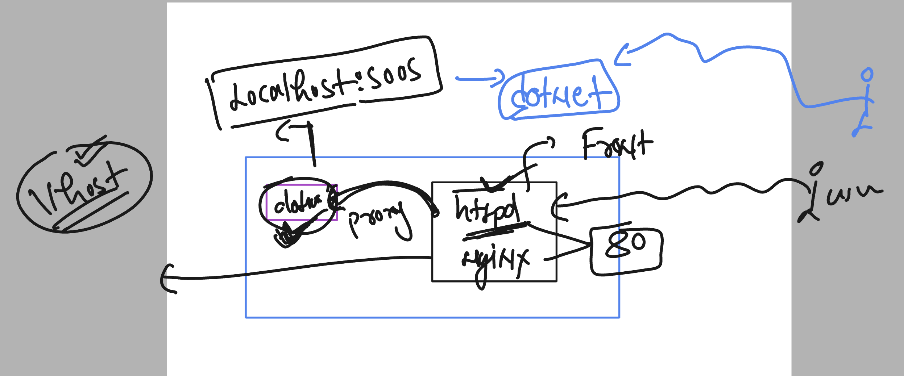
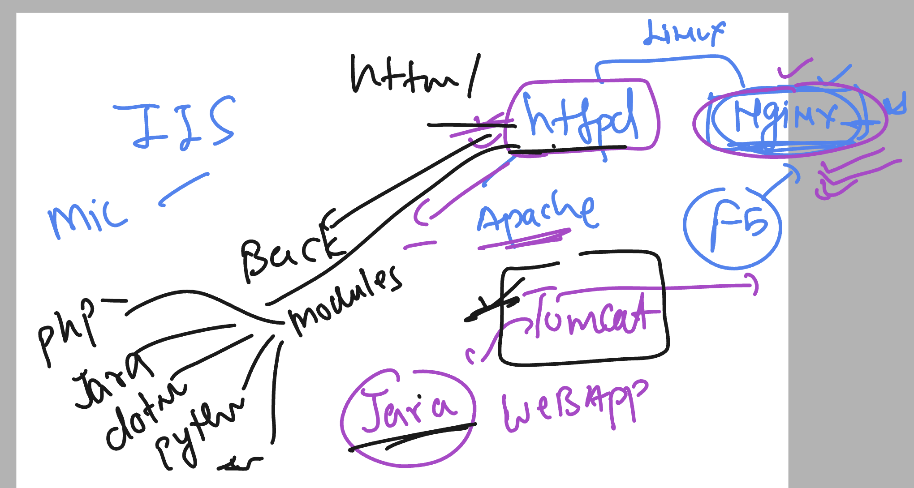

# linux-dotnet-vodafone

### connection and verify 

```
 hostname
ashu-linux-vm

[opc@ashu-linux-vm ~]$ uname 
Linux

[opc@ashu-linux-vm ~]$ uname  -r
4.18.0-517.el8.x86_64

[opc@ashu-linux-vm ~]$

[opc@ashu-linux-vm ~]$ cat  /etc/os-release 
NAME="CentOS Stream"
VERSION="8"
ID="centos"
ID_LIKE="rhel fedora"
VERSION_ID="8"
PLATFORM_ID="platform:el8"

```

## Understanding dotnet app creation and running cases 


### understanding dotnet CLi 


## Dotnet command line updates

### listing app template optins 

```
 dotnet  new list
These templates matched your input: 

Template Name                                 Short Name                  Language    Tags                      
--------------------------------------------  --------------------------  ----------  --------------------------
API Controller                                apicontroller               [C#]        Web/ASP.NET               
ASP.NET Core Empty                            web                         [C#],F#     Web/Empty                 
ASP.NET Core gRPC Service                     grpc                        [C#]        Web/gRPC/API/Service      
ASP.NET Core Web API                          webapi                      [C#],F#     Web/Web API/API/Service   
ASP.NET Core Web API (native AOT)             webapiaot                   [C#]        Web/Web API/API/Service   
ASP.NET Core Web App                          webapp,razor                [C#]        Web/MVC/Razor Pages       
ASP.NET Core Web App (Model-View-Controller)  mvc                         [C#],F#     Web/MVC                   
Blazor Web App                                blazor                      [C#]        Web/Blazor/WebAssembly    
Blazor WebAssembly Standalone App             blazorwasm                  [C#]        Web/Blazor/WebAssembly/PWA
Class Library                                 classlib                    [C#],F#,VB  Common/Library            
Console App                                   console                     [C#],F#,VB  Common/Console            
dotnet gitignore file                         gitignore,.gitignore                    Config                    
Dotnet local tool manifest file               tool-manifest                           Config                    
EditorConfig file                             editorconfig,.editorconfig
```

### lets create a console app 

```
 ls
ConsoleApp1  ConsoleApp1.sln  WebApplication1
[opc@ashu-linux-vm ashudotnetApp]$ 
[opc@ashu-linux-vm ashudotnetApp]$ dotnet  new  console -n ashuconsoleApp1 
The template "Console App" was created successfully.

Processing post-creation actions...
Restoring /home/opc/ashudotnetApp/ashuconsoleApp1/ashuconsoleApp1.csproj:
  Determining projects to restore...
  Restored /home/opc/ashudotnetApp/ashuconsoleApp1/ashuconsoleApp1.csproj (in 169 ms).
Restore succeeded.


[opc@ashu-linux-vm ashudotnetApp]$ ls
ashuconsoleApp1  ConsoleApp1  ConsoleApp1.sln  WebApplication1
[opc@ashu-linux-vm ashudotnetApp]$

[opc@ashu-linux-vm ashudotnetApp]$ cd  ashuconsoleApp1/
[opc@ashu-linux-vm ashuconsoleApp1]$ ls
ashuconsoleApp1.csproj  obj  Program.cs
[opc@ashu-linux-vm ashuconsoleApp1]$ cat Program.cs 
// See https://aka.ms/new-console-template for more information
Console.WriteLine("Hello, World!");
[opc@ashu-linux-vm ashuconsoleApp1]$ 

```

### lets test app by running it 

```
 ls
ashuconsoleApp1.csproj  obj  Program.cs
[opc@ashu-linux-vm ashuconsoleApp1]$ dotnet  run 
Hello, World!
[opc@ashu-linux-vm ashuconsoleApp1]$ vim Program.cs 

[opc@ashu-linux-vm ashuconsoleApp1]$ dotnet  run 
Hello, World!
Hello, ashu !
```

### lets test with MVC based webapp

```
  90  dotnet new  mvc -n ashuMVCapp1 -o my-new-projectr
   91  ls
   92  ls my-new-projectr/
   93  history 
[opc@ashu-linux-vm ashudotnetApp]$ 
[opc@ashu-linux-vm ashudotnetApp]$ 
[opc@ashu-linux-vm ashudotnetApp]$ dotnet new  mvc -n ashuMVCapp1 
The template "ASP.NET Core Web App (Model-View-Controller)" was created successfully.
This template contains technologies from parties other than Microsoft, see https://aka.ms/aspnetcore/8.0-third-party-notices for details.

Processing post-creation actions...
Restoring /home/opc/ashudotnetApp/ashuMVCapp1/ashuMVCapp1.csproj:
  Determining projects to restore...
  Restored /home/opc/ashudotnetApp/ashuMVCapp1/ashuMVCapp1.csproj (in 174 ms).
Restore succeeded.


[opc@ashu-linux-vm ashudotnetApp]$ ls
ashuconsoleApp1  ashuMVCapp1  ConsoleApp1  ConsoleApp1.sln  my-new-projectr  WebApplication1
```

###  for webapp we can build as well

```
 dotnet  build 
MSBuild version 17.8.0+6cdef4241 for .NET
  Determining projects to restore...
  All projects are up-to-date for restore.
/usr/lib64/dotnet/sdk/8.0.100-rc.2.23502.1/Sdks/Microsoft.NET.Sdk/targets/Microsoft.NET.RuntimeIdentifierInference.targets(311,5): message NETSDK1057: You are using a preview version of .NET. See: https://aka.ms/dotnet-support-policy [/home/opc/ashudotnetApp/ashuMVCapp1/ashuMVCapp1.csproj]
  ashuMVCapp1 -> /home/opc/ashudotnetApp/ashuMVCapp1/bin/Debug/net8.0/ashuMVCapp1.dll

Build succeeded.
    0 Warning(s)
    0 Error(s)

Time Elapsed 00:00:01.19
[opc@ashu-linux-vm ashuMVCapp1]$ ls
appsettings.Development.json  ashuMVCapp1.csproj  Controllers  obj         Properties  wwwroot
appsettings.json              bin                 Models       Program.cs  Views
[opc@ashu-linux-vm ashuMVCapp1]$ ls  bin/
Debug
[opc@ashu-linux-vm ashuMVCapp1]$ ls  bin/Debug/net8.0/
appsettings.Development.json  ashuMVCapp1            ashuMVCapp1.dll  ashuMVCapp1.runtimeconfig.json
appsettings.json              ashuMVCapp1.deps.json  ashuMVCapp1.pdb  ashuMVCapp1.staticwebassets.runtime.json
[opc@ashu-linux-vm ashuMVCapp1]$ 
```

### we can run .dll file directly 

```
dotnet run bin/Debug/net8.0/ashuMVCapp1.dll
Building...
info: Microsoft.Hosting.Lifetime[14]
      Now listening on: http://localhost:5158
info: Microsoft.Hosting.Lifetime[0]
```

### running with port number 

```
  124  dotnet run bin/Debug/net8.0/ashuMVCapp1.dll --urls=http://0.0.0.0:5000
  125  history 
[opc@ashu-linux-vm ashuMVCapp1]$ ls
appsettings.Development.json  ashuMVCapp1.csproj  Controllers  obj         Properties  wwwroot
appsettings.json              bin                 Models       Program.cs  Views
[opc@ashu-linux-vm ashuMVCapp1]$ 
```

### firewall-cmd with reload optins

```
sudo firewall-cmd --reload 
success
[opc@ashu-linux-vm testing]$ sudo firewall-cmd --add-port=3000/tcp --permanent 
success
[opc@ashu-linux-vm testing]$ 
[opc@ashu-linux-vm testing]$ 
[opc@ashu-linux-vm testing]$ sudo firewall-cmd --list-ports 
80/tcp 5005/tcp
[opc@ashu-linux-vm testing]$ 
[opc@ashu-linux-vm testing]$ 
[opc@ashu-linux-vm testing]$ sudo firewall-cmd --reload 
success
[opc@ashu-linux-vm testing]$ 
[opc@ashu-linux-vm testing]$ sudo firewall-cmd --list-ports 
80/tcp 3000/tcp 5005/tcp
[opc@ashu-linux-vm testing]$ 


```

### understanding dotnet along with httpd / nginx 



### web server 



### checking existing webapp by apache httpd

```
[opc@ashu-linux-vm testing]$ rpm -q httpd
httpd-2.4.37-62.module_el8+657+88b2113f.x86_64
[opc@ashu-linux-vm testing]$ 
[opc@ashu-linux-vm testing]$ 
[opc@ashu-linux-vm testing]$ systemctl status  httpd
● httpd.service - The Apache HTTP Server
   Loaded: loaded (/usr/lib/systemd/system/httpd.service; enabled; vendor preset: disabled)
   Active: active (running) since Wed 2023-12-13 04:41:28 GMT; 2h 5min ago
     Docs: man:httpd.service(8)
 Main PID: 1520 (httpd)
   Status: "Total requests: 132; Idle/Busy workers 100/0;Requests/sec: 0.0176; Bytes served/sec:  10 B/sec"
    Tasks: 213 (limit: 22608)
   Memory: 23.0M
   CGroup: /system.slice/httpd.service
           ├─1520 /usr/sbin/httpd -DFOREGROUND
           ├─1702 /usr/sbin/httpd -DFOREGROUND
           ├─1705 /usr/sbin/httpd -DFOREGROUND
           ├─1706 /usr/sbin/httpd -DFOREGROUND
           └─1707 /usr/sbin/httpd -DFOREGROUND

Dec 13 04:41:27 ashu-linux-vm systemd[1]: Starting The Apache HTTP Server...
Dec 13 04:41:28 ashu-linux-vm systemd[1]: Started The Apache HTTP Server.
Dec 13 04:41:28 ashu-linux-vm httpd[1520]: Server configured, listening on: port 80
[opc@ashu-linux-vm testing]$ 

[opc@ashu-linux-vm testing]$ 
[opc@ashu-linux-vm testing]$ 
[opc@ashu-linux-vm testing]$ 
[opc@ashu-linux-vm testing]$ 
[opc@ashu-linux-vm testing]$ cd  /etc/httpd/
[opc@ashu-linux-vm httpd]$ ls
conf  conf.d  conf.modules.d  logs  modules  run  state
[opc@ashu-linux-vm httpd]$ cd conf.d/
[opc@ashu-linux-vm conf.d]$ ls
README  ashu-adhoc.conf  ashu-delvex.conf  autoindex.conf  default.conf  userdir.conf  welcome.conf
[opc@ashu-linux-vm conf.d]$ cat ashu-adhoc.conf 
<virtualhost *:80>
	servername ashu.adhocnet.org
	documentroot /var/www/adhoc/
</virtualhost>
[opc@ashu-linux-vm conf.d]$ cat  ashu-delvex.conf 
<virtualhost *:80>
	servername ashu.delvex.io
	documentroot /var/www/delvex/
</virtualhost>
[opc@ashu-linux-vm conf.d]$ 


```

### dotnet app using apache httpd 


