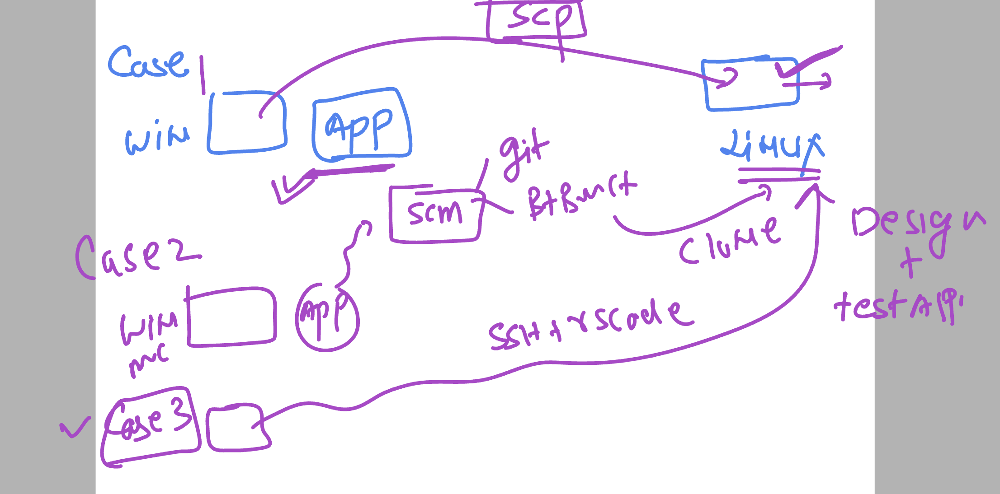
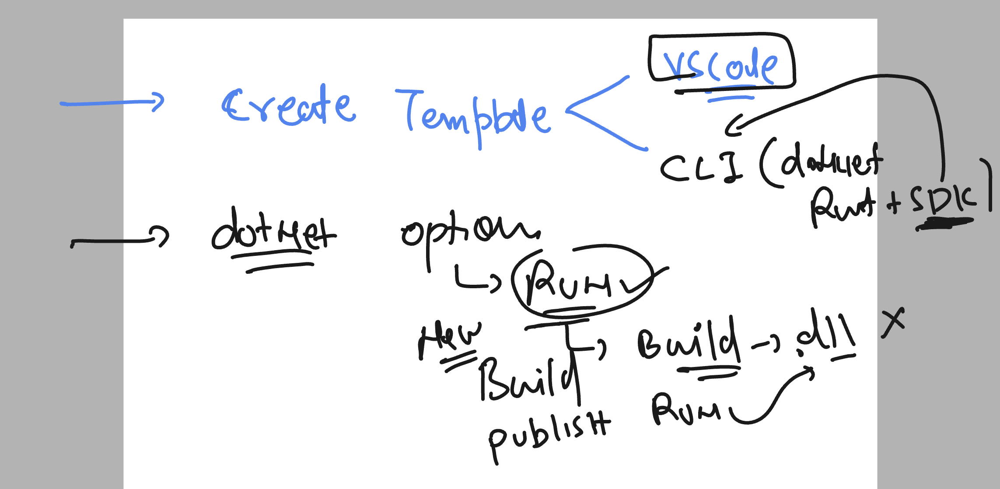

# linux-dotnet-vodafone

### connection and verify 

```
 hostname
ashu-linux-vm

[opc@ashu-linux-vm ~]$ uname 
Linux

[opc@ashu-linux-vm ~]$ uname  -r
4.18.0-517.el8.x86_64

[opc@ashu-linux-vm ~]$

[opc@ashu-linux-vm ~]$ cat  /etc/os-release 
NAME="CentOS Stream"
VERSION="8"
ID="centos"
ID_LIKE="rhel fedora"
VERSION_ID="8"
PLATFORM_ID="platform:el8"

```

## Understanding dotnet app creation and running cases 



### understanding dotnet CLi 



## Dotnet command line updates

### listing app template optins 

```
 dotnet  new list
These templates matched your input: 

Template Name                                 Short Name                  Language    Tags                      
--------------------------------------------  --------------------------  ----------  --------------------------
API Controller                                apicontroller               [C#]        Web/ASP.NET               
ASP.NET Core Empty                            web                         [C#],F#     Web/Empty                 
ASP.NET Core gRPC Service                     grpc                        [C#]        Web/gRPC/API/Service      
ASP.NET Core Web API                          webapi                      [C#],F#     Web/Web API/API/Service   
ASP.NET Core Web API (native AOT)             webapiaot                   [C#]        Web/Web API/API/Service   
ASP.NET Core Web App                          webapp,razor                [C#]        Web/MVC/Razor Pages       
ASP.NET Core Web App (Model-View-Controller)  mvc                         [C#],F#     Web/MVC                   
Blazor Web App                                blazor                      [C#]        Web/Blazor/WebAssembly    
Blazor WebAssembly Standalone App             blazorwasm                  [C#]        Web/Blazor/WebAssembly/PWA
Class Library                                 classlib                    [C#],F#,VB  Common/Library            
Console App                                   console                     [C#],F#,VB  Common/Console            
dotnet gitignore file                         gitignore,.gitignore                    Config                    
Dotnet local tool manifest file               tool-manifest                           Config                    
EditorConfig file                             editorconfig,.editorconfig
```

### lets create a console app 

```
 ls
ConsoleApp1  ConsoleApp1.sln  WebApplication1
[opc@ashu-linux-vm ashudotnetApp]$ 
[opc@ashu-linux-vm ashudotnetApp]$ dotnet  new  console -n ashuconsoleApp1 
The template "Console App" was created successfully.

Processing post-creation actions...
Restoring /home/opc/ashudotnetApp/ashuconsoleApp1/ashuconsoleApp1.csproj:
  Determining projects to restore...
  Restored /home/opc/ashudotnetApp/ashuconsoleApp1/ashuconsoleApp1.csproj (in 169 ms).
Restore succeeded.


[opc@ashu-linux-vm ashudotnetApp]$ ls
ashuconsoleApp1  ConsoleApp1  ConsoleApp1.sln  WebApplication1
[opc@ashu-linux-vm ashudotnetApp]$

[opc@ashu-linux-vm ashudotnetApp]$ cd  ashuconsoleApp1/
[opc@ashu-linux-vm ashuconsoleApp1]$ ls
ashuconsoleApp1.csproj  obj  Program.cs
[opc@ashu-linux-vm ashuconsoleApp1]$ cat Program.cs 
// See https://aka.ms/new-console-template for more information
Console.WriteLine("Hello, World!");
[opc@ashu-linux-vm ashuconsoleApp1]$ 

```

### lets test app by running it 

```
 ls
ashuconsoleApp1.csproj  obj  Program.cs
[opc@ashu-linux-vm ashuconsoleApp1]$ dotnet  run 
Hello, World!
[opc@ashu-linux-vm ashuconsoleApp1]$ vim Program.cs 

[opc@ashu-linux-vm ashuconsoleApp1]$ dotnet  run 
Hello, World!
Hello, ashu !
```

