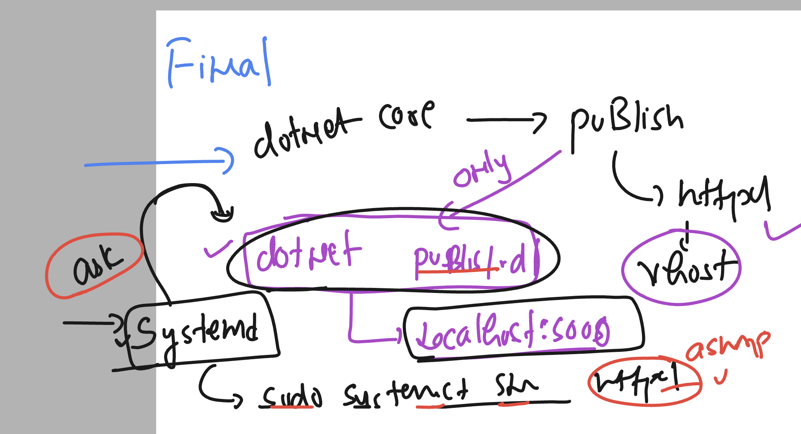
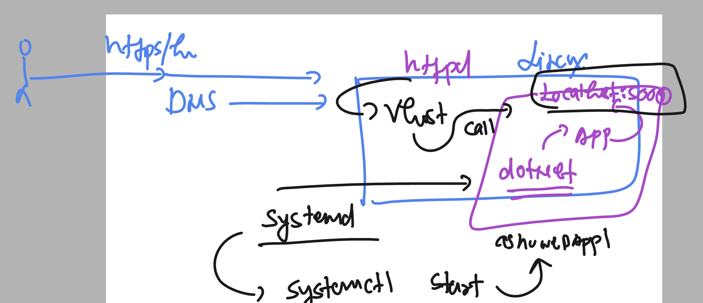

# linux-dotnet-vodafone

### connection and verify 

```
 hostname
ashu-linux-vm

[opc@ashu-linux-vm ~]$ uname 
Linux

[opc@ashu-linux-vm ~]$ uname  -r
4.18.0-517.el8.x86_64

[opc@ashu-linux-vm ~]$

[opc@ashu-linux-vm ~]$ cat  /etc/os-release 
NAME="CentOS Stream"
VERSION="8"
ID="centos"
ID_LIKE="rhel fedora"
VERSION_ID="8"
PLATFORM_ID="platform:el8"

```

## Understanding dotnet app creation and running cases 


### understanding dotnet CLi 


## Dotnet command line updates

### listing app template optins 

```
 dotnet  new list
These templates matched your input: 

Template Name                                 Short Name                  Language    Tags                      
--------------------------------------------  --------------------------  ----------  --------------------------
API Controller                                apicontroller               [C#]        Web/ASP.NET               
ASP.NET Core Empty                            web                         [C#],F#     Web/Empty                 
ASP.NET Core gRPC Service                     grpc                        [C#]        Web/gRPC/API/Service      
ASP.NET Core Web API                          webapi                      [C#],F#     Web/Web API/API/Service   
ASP.NET Core Web API (native AOT)             webapiaot                   [C#]        Web/Web API/API/Service   
ASP.NET Core Web App                          webapp,razor                [C#]        Web/MVC/Razor Pages       
ASP.NET Core Web App (Model-View-Controller)  mvc                         [C#],F#     Web/MVC                   
Blazor Web App                                blazor                      [C#]        Web/Blazor/WebAssembly    
Blazor WebAssembly Standalone App             blazorwasm                  [C#]        Web/Blazor/WebAssembly/PWA
Class Library                                 classlib                    [C#],F#,VB  Common/Library            
Console App                                   console                     [C#],F#,VB  Common/Console            
dotnet gitignore file                         gitignore,.gitignore                    Config                    
Dotnet local tool manifest file               tool-manifest                           Config                    
EditorConfig file                             editorconfig,.editorconfig
```

### lets create a console app 

```
 ls
ConsoleApp1  ConsoleApp1.sln  WebApplication1
[opc@ashu-linux-vm ashudotnetApp]$ 
[opc@ashu-linux-vm ashudotnetApp]$ dotnet  new  console -n ashuconsoleApp1 
The template "Console App" was created successfully.

Processing post-creation actions...
Restoring /home/opc/ashudotnetApp/ashuconsoleApp1/ashuconsoleApp1.csproj:
  Determining projects to restore...
  Restored /home/opc/ashudotnetApp/ashuconsoleApp1/ashuconsoleApp1.csproj (in 169 ms).
Restore succeeded.


[opc@ashu-linux-vm ashudotnetApp]$ ls
ashuconsoleApp1  ConsoleApp1  ConsoleApp1.sln  WebApplication1
[opc@ashu-linux-vm ashudotnetApp]$

[opc@ashu-linux-vm ashudotnetApp]$ cd  ashuconsoleApp1/
[opc@ashu-linux-vm ashuconsoleApp1]$ ls
ashuconsoleApp1.csproj  obj  Program.cs
[opc@ashu-linux-vm ashuconsoleApp1]$ cat Program.cs 
// See https://aka.ms/new-console-template for more information
Console.WriteLine("Hello, World!");
[opc@ashu-linux-vm ashuconsoleApp1]$ 

```

### lets test app by running it 

```
 ls
ashuconsoleApp1.csproj  obj  Program.cs
[opc@ashu-linux-vm ashuconsoleApp1]$ dotnet  run 
Hello, World!
[opc@ashu-linux-vm ashuconsoleApp1]$ vim Program.cs 

[opc@ashu-linux-vm ashuconsoleApp1]$ dotnet  run 
Hello, World!
Hello, ashu !
```

### lets test with MVC based webapp

```
  90  dotnet new  mvc -n ashuMVCapp1 -o my-new-projectr
   91  ls
   92  ls my-new-projectr/
   93  history 
[opc@ashu-linux-vm ashudotnetApp]$ 
[opc@ashu-linux-vm ashudotnetApp]$ 
[opc@ashu-linux-vm ashudotnetApp]$ dotnet new  mvc -n ashuMVCapp1 
The template "ASP.NET Core Web App (Model-View-Controller)" was created successfully.
This template contains technologies from parties other than Microsoft, see https://aka.ms/aspnetcore/8.0-third-party-notices for details.

Processing post-creation actions...
Restoring /home/opc/ashudotnetApp/ashuMVCapp1/ashuMVCapp1.csproj:
  Determining projects to restore...
  Restored /home/opc/ashudotnetApp/ashuMVCapp1/ashuMVCapp1.csproj (in 174 ms).
Restore succeeded.


[opc@ashu-linux-vm ashudotnetApp]$ ls
ashuconsoleApp1  ashuMVCapp1  ConsoleApp1  ConsoleApp1.sln  my-new-projectr  WebApplication1
```

###  for webapp we can build as well

```
 dotnet  build 
MSBuild version 17.8.0+6cdef4241 for .NET
  Determining projects to restore...
  All projects are up-to-date for restore.
/usr/lib64/dotnet/sdk/8.0.100-rc.2.23502.1/Sdks/Microsoft.NET.Sdk/targets/Microsoft.NET.RuntimeIdentifierInference.targets(311,5): message NETSDK1057: You are using a preview version of .NET. See: https://aka.ms/dotnet-support-policy [/home/opc/ashudotnetApp/ashuMVCapp1/ashuMVCapp1.csproj]
  ashuMVCapp1 -> /home/opc/ashudotnetApp/ashuMVCapp1/bin/Debug/net8.0/ashuMVCapp1.dll

Build succeeded.
    0 Warning(s)
    0 Error(s)

Time Elapsed 00:00:01.19
[opc@ashu-linux-vm ashuMVCapp1]$ ls
appsettings.Development.json  ashuMVCapp1.csproj  Controllers  obj         Properties  wwwroot
appsettings.json              bin                 Models       Program.cs  Views
[opc@ashu-linux-vm ashuMVCapp1]$ ls  bin/
Debug
[opc@ashu-linux-vm ashuMVCapp1]$ ls  bin/Debug/net8.0/
appsettings.Development.json  ashuMVCapp1            ashuMVCapp1.dll  ashuMVCapp1.runtimeconfig.json
appsettings.json              ashuMVCapp1.deps.json  ashuMVCapp1.pdb  ashuMVCapp1.staticwebassets.runtime.json
[opc@ashu-linux-vm ashuMVCapp1]$ 
```

### we can run .dll file directly 

```
dotnet run bin/Debug/net8.0/ashuMVCapp1.dll
Building...
info: Microsoft.Hosting.Lifetime[14]
      Now listening on: http://localhost:5158
info: Microsoft.Hosting.Lifetime[0]
```

### running with port number 

```
  124  dotnet run bin/Debug/net8.0/ashuMVCapp1.dll --urls=http://0.0.0.0:5000
  125  history 
[opc@ashu-linux-vm ashuMVCapp1]$ ls
appsettings.Development.json  ashuMVCapp1.csproj  Controllers  obj         Properties  wwwroot
appsettings.json              bin                 Models       Program.cs  Views
[opc@ashu-linux-vm ashuMVCapp1]$ 
```

### firewall-cmd with reload optins

```
sudo firewall-cmd --reload 
success
[opc@ashu-linux-vm testing]$ sudo firewall-cmd --add-port=3000/tcp --permanent 
success
[opc@ashu-linux-vm testing]$ 
[opc@ashu-linux-vm testing]$ 
[opc@ashu-linux-vm testing]$ sudo firewall-cmd --list-ports 
80/tcp 5005/tcp
[opc@ashu-linux-vm testing]$ 
[opc@ashu-linux-vm testing]$ 
[opc@ashu-linux-vm testing]$ sudo firewall-cmd --reload 
success
[opc@ashu-linux-vm testing]$ 
[opc@ashu-linux-vm testing]$ sudo firewall-cmd --list-ports 
80/tcp 3000/tcp 5005/tcp
[opc@ashu-linux-vm testing]$ 


```

### understanding dotnet along with httpd / nginx 


### web server 


### checking existing webapp by apache httpd

```
[opc@ashu-linux-vm testing]$ rpm -q httpd
httpd-2.4.37-62.module_el8+657+88b2113f.x86_64
[opc@ashu-linux-vm testing]$ 
[opc@ashu-linux-vm testing]$ 
[opc@ashu-linux-vm testing]$ systemctl status  httpd
● httpd.service - The Apache HTTP Server
   Loaded: loaded (/usr/lib/systemd/system/httpd.service; enabled; vendor preset: disabled)
   Active: active (running) since Wed 2023-12-13 04:41:28 GMT; 2h 5min ago
     Docs: man:httpd.service(8)
 Main PID: 1520 (httpd)
   Status: "Total requests: 132; Idle/Busy workers 100/0;Requests/sec: 0.0176; Bytes served/sec:  10 B/sec"
    Tasks: 213 (limit: 22608)
   Memory: 23.0M
   CGroup: /system.slice/httpd.service
           ├─1520 /usr/sbin/httpd -DFOREGROUND
           ├─1702 /usr/sbin/httpd -DFOREGROUND
           ├─1705 /usr/sbin/httpd -DFOREGROUND
           ├─1706 /usr/sbin/httpd -DFOREGROUND
           └─1707 /usr/sbin/httpd -DFOREGROUND

Dec 13 04:41:27 ashu-linux-vm systemd[1]: Starting The Apache HTTP Server...
Dec 13 04:41:28 ashu-linux-vm systemd[1]: Started The Apache HTTP Server.
Dec 13 04:41:28 ashu-linux-vm httpd[1520]: Server configured, listening on: port 80
[opc@ashu-linux-vm testing]$ 

[opc@ashu-linux-vm testing]$ 
[opc@ashu-linux-vm testing]$ 
[opc@ashu-linux-vm testing]$ 
[opc@ashu-linux-vm testing]$ 
[opc@ashu-linux-vm testing]$ cd  /etc/httpd/
[opc@ashu-linux-vm httpd]$ ls
conf  conf.d  conf.modules.d  logs  modules  run  state
[opc@ashu-linux-vm httpd]$ cd conf.d/
[opc@ashu-linux-vm conf.d]$ ls
README  ashu-adhoc.conf  ashu-delvex.conf  autoindex.conf  default.conf  userdir.conf  welcome.conf
[opc@ashu-linux-vm conf.d]$ cat ashu-adhoc.conf 
<virtualhost *:80>
	servername ashu.adhocnet.org
	documentroot /var/www/adhoc/
</virtualhost>
[opc@ashu-linux-vm conf.d]$ cat  ashu-delvex.conf 
<virtualhost *:80>
	servername ashu.delvex.io
	documentroot /var/www/delvex/
</virtualhost>
[opc@ashu-linux-vm conf.d]$ 


```

## dotnet app using apache httpd 

### making a publish release of dotnet app

```
 dotnet publish 
MSBuild version 17.8.0+6cdef4241 for .NET
  Determining projects to restore...
  All projects are up-to-date for restore.
/usr/lib64/dotnet/sdk/8.0.100-rc.2.23502.1/Sdks/Microsoft.NET.Sdk/targets/Microsoft.NET.RuntimeIdentifierInference.targets(311,5): message NETSDK1057: You are using a preview version of .NET. See: https://aka.ms/dotnet-support-policy [/home/opc/ashudotnetApp/ashuMVCapp1/ashuMVCapp1.csproj]
  ashuMVCapp1 -> /home/opc/ashudotnetApp/ashuMVCapp1/bin/Release/net8.0/ashuMVCapp1.dll
  ashuMVCapp1 -> /home/opc/ashudotnetApp/ashuMVCapp1/bin/Release/net8.0/publish/
[opc@ashu-linux-vm ashuMVCapp1]$ ls
appsettings.Development.json  ashuMVCapp1.csproj  Controllers  obj         Properties  wwwroot
appsettings.json              bin                 Models       Program.cs  Views
[opc@ashu-linux-vm ashuMVCapp1]$ cd bin/
[opc@ashu-linux-vm bin]$ ls
Debug  Release
[opc@ashu-linux-vm bin]$ cd Release/
[opc@ashu-linux-vm Release]$ ls
net8.0
[opc@ashu-linux-vm Release]$ cd net8.0/
[opc@ashu-linux-vm net8.0]$ ls
appsettings.Development.json  ashuMVCapp1.deps.json  ashuMVCapp1.runtimeconfig.json
appsettings.json              ashuMVCapp1.dll        ashuMVCapp1.staticwebassets.runtime.json
ashuMVCapp1                   ashuMVCapp1.pdb        publish
[opc@ashu-linux-vm net8.0]$ cd publish/
[opc@ashu-linux-vm publish]$ ls
appsettings.Development.json  ashuMVCapp1            ashuMVCapp1.dll  ashuMVCapp1.runtimeconfig.json  wwwroot
appsettings.json              ashuMVCapp1.deps.json  ashuMVCapp1.pdb  web.config
[opc@ashu-linux-vm publish]$ 
```

### copy publish folder to vhost location of apache httpd 

```
sudo cp -rf publish/ /var/www/delvex/
```

## finally 

### apache httpd with dotnet publish content

```
====>>
cd  /etc/httpd/
[opc@ashu-linux-vm httpd]$ ls
conf  conf.d  conf.modules.d  logs  modules  run  state

[opc@ashu-linux-vm httpd]$ cd conf.d/

[opc@ashu-linux-vm conf.d]$ ls
README  ashu-adhoc.conf  ashu-delvex.conf  autoindex.conf  default.conf  userdir.conf  welcome.conf

[opc@ashu-linux-vm conf.d]$ cat  ashu-delvex.conf 
<virtualhost *:80>
#  we wanto run dotnet app using this vhost 
	servername ashu.delvex.io
	documentroot /var/www/delvex/
</virtualhost>
[opc@ashu-linux-vm conf.d]$ 


===========>>>

 cd  /var/www/delvex/
[opc@ashu-linux-vm delvex]$ ls
index.html  publish

```

### Note: publish directory is outcome of dotnet publish 

### verify publish folder data

```
[opc@ashu-linux-vm delvex]$ ls
index.html  publish
[opc@ashu-linux-vm delvex]$ cd  publish/
[opc@ashu-linux-vm publish]$ ls
appsettings.Development.json  ashuMVCapp1            ashuMVCapp1.dll  ashuMVCapp1.runtimeconfig.json  wwwroot
appsettings.json              ashuMVCapp1.deps.json  ashuMVCapp1.pdb  web.config


[opc@ashu-linux-vm publish]$ dotnet   ashuMVCapp1.dll 
info: Microsoft.Hosting.Lifetime[14]
      Now listening on: http://localhost:5000
info: Microsoft.Hosting.Lifetime[0]
      Application started. Press Ctrl+C to shut down.
info: Microsoft.Hosting.Lifetime[0]
      Hosting environment: Production
info: Microsoft.Hosting.Lifetime[0]
      Content root path: /var/www/delvex/publish
^Cinfo: Microsoft.Hosting.Lifetime[0]
      Application is shutting down...
[opc@ashu-linux-vm publish]$ 

```

### adjusting in apache vhostfile

```
<virtualhost *:80>
#  we wanto run dotnet app using this vhost 
	servername ashu.delvex.io
	documentroot /var/www/delvex/publish/
#  apache httpd can redirect / proxy traffice to dotnet generated local URL 
	ProxyPass /  http://localhost:5000/
	ProxyPassReverse / http://localhost:5000/
</virtualhost>
```

## final understanding of systemd with dotnet 



### Final understanding of dotnet app in linux 



### logs in httpd 

```
@ashu-linux-vm ~]$ 
[opc@ashu-linux-vm ~]$ cd /var/log/
[opc@ashu-linux-vm log]$ ls
audit              btmp                   cloud-init.log   dnf.log      hawkey.log  lastlog   oracle-cloud-agent  samba    sssd
boot.log           chrony                 cron             dnf.rpm.log  httpd       maillog   private             secure   tuned
boot.log-20231213  cloud-init-output.log  dnf.librepo.log  firewalld    kdump.log   messages  qemu-ga             spooler  wtmp
[opc@ashu-linux-vm log]$ cd  httpd/
```

### logs in linux 

```
/var/log/
```

### custom logs configuration in dotnet app

```
 cd  /etc/httpd/conf.d/
[opc@ashu-linux-vm conf.d]$ ls
README  ashu-adhoc.conf  ashu-delvex.conf  autoindex.conf  default.conf  userdir.conf  welcome.conf
[opc@ashu-linux-vm conf.d]$ sudo vim ashu-delvex.conf 
[opc@ashu-linux-vm conf.d]$ cat  ashu-delvex.conf 
<virtualhost *:80>
#  we wanto run dotnet app using this vhost 
	servername ashu.delvex.io
	documentroot /var/www/delvex/publish/
#  apache httpd can redirect / proxy traffice to dotnet generated local URL 
	ProxyPass /  http://localhost:5001/
	ProxyPassReverse / http://localhost:5001/
	ErrorLog /var/log/httpd/ashuapp_error.log
 	CustomLog /var/log/httpd/ashuapp_access.log combined
</virtualhost>

[opc@ashu-linux-vm conf.d]$ sudo systemctl restart httpd
[opc@ashu-linux-vm conf.d]$

[opc@ashu-linux-vm conf.d]$ cd  /var/log/
[opc@ashu-linux-vm log]$ ls
audit              btmp                   cloud-init.log   dnf.log      hawkey.log  lastlog   oracle-cloud-agent  samba    sssd
boot.log           chrony                 cron             dnf.rpm.log  httpd       maillog   private             secure   tuned
boot.log-20231213  cloud-init-output.log  dnf.librepo.log  firewalld    kdump.log   messages  qemu-ga             spooler  wtmp


[opc@ashu-linux-vm log]$ sudo ls  httpd/
access_log  ashuapp_access.log	ashuapp_error.log  error_log
[opc@ashu-linux-vm log]$ 


```

### creating systemd file for dotnet core app

```
 cd /etc/systemd/system/
[opc@ashu-linux-vm system]$ ls
 ====>>>
 sudo vim  ashuapp.service

cat ashuapp.service 
[Unit]
Description=ashu ASP.NET Core Application

[Service]
WorkingDirectory=/var/www/delvex/publish/
ExecStart=/var/www/delvex/publish/ashuMVCapp1  --urls=http://localhost:5001
Restart=always
RestartSec=10
SyslogIdentifier=your-app
User=opc
Environment=ASPNETCORE_ENVIRONMENT=Production

[Install]
WantedBy=multi-user.target

                       
```

### starting service

```
[opc@ashu-linux-vm system]$ ls
 ashuapp.service                                            iscsid.service.d
 basic.target.wants                                         multi-user.target.wants
 cloud-init.target.wants                                    network-online.target.wants
 ctrl-alt-del.target                                        oracle-cloud-agent-updater.service
 dbus-org.fedoraproject.FirewallD1.service                  oracle-cloud-agent.service
 dbus-org.freedesktop.nm-dispatcher.service                 remote-fs.target.wants
 dbus-org.freedesktop.timedate1.service                     sockets.target.wants
 default.target                                             sshd-keygen@.service.d
 default.target.wants                                       sysinit.target.wants
'dev-virtio\x2dports-org.qemu.guest_agent.0.device.wants'   syslog.service
 getty.target.wants                                         systemd-timedated.service
 graphical.target.wants                                     timers.target.wants


[opc@ashu-linux-vm system]$ sudo systemctl daemon-reload 
[opc@ashu-linux-vm system]$ sudo systemctl start  ashuapp


[opc@ashu-linux-vm system]$ sudo systemctl status  ashuapp 
● ashuapp.service - ashu ASP.NET Core Application
   Loaded: loaded (/etc/systemd/system/ashuapp.service; disabled; vendor preset: disabled)
   Active: active (running) since Wed 2023-12-13 07:53:06 GMT; 1h 50min ago
 Main PID: 11872 (ashuMVCapp1)
    Tasks: 15 (limit: 22608)
   Memory: 31.8M
   CGroup: /system.slice/ashuapp.service
           └─11872 /var/www/delvex/publish/ashuMVCapp1 --urls=http://localhost:5001


```

### check with security 

```
sudo setenforce 0
```


### checking access logs

```
[opc@ashu-linux-vm system]$ cd  /var/log/
[opc@ashu-linux-vm log]$ ls
audit              btmp                   cloud-init.log   dnf.log      hawkey.log  lastlog   oracle-cloud-agent  samba    sssd
boot.log           chrony                 cron             dnf.rpm.log  httpd       maillog   private             secure   tuned
boot.log-20231213  cloud-init-output.log  dnf.librepo.log  firewalld    kdump.log   messages  qemu-ga             spooler  wtmp
[opc@ashu-linux-vm log]$ ls httpd/
ls: cannot open directory 'httpd/': Permission denied
[opc@ashu-linux-vm log]$ 
[opc@ashu-linux-vm log]$ sudo ls httpd/
access_log  ashuapp_access.log	ashuapp_error.log  error_log
[opc@ashu-linux-vm log]$ 
[opc@ashu-linux-vm log]$ 
[opc@ashu-linux-vm log]$ sudo cat  httpd/ashuapp_access.log
172.70.242.162 - - [13/Dec/2023:07:55:23 +0000] "GET / HTTP/1.1" 200 2513 "-" "Mozilla/5.0 (Macintosh; Intel Mac OS X 10_15_7) AppleWebKit/537.36 (KHTML, like Gecko) Chrome/119.0.0.0 Safari/537.36"
172.70.243.191 - - [13/Dec/2023:07:55:54 +0000] "GET / HTTP/1.1" 200 2513 "-" "Mozilla/5.0 (Macintosh; Intel Mac OS X 10_15_7) AppleWebKit/537.36 (KHTML, like Gecko) Chrome/119.0.0.0 Safari/537.36"
172.70.243.191 - - [13/Dec/2023:07:55:56 +0000] "GET / HTTP/1.1" 200 2513 "-" "Mozilla/5.0 (Macintosh; Intel Mac OS X 10_15_7) AppleWebKit/537.36 (KHTML, like Gecko) Chrome/119.0.0.0 Safari/537.36"
172.70.243.191 - - [13/Dec/2023:07:55:57 +0000] "GET / HTTP/1.1" 200 2513 "-" "Mozilla/5.0 (Macintosh; Intel Mac OS X 10_15_7) AppleWebKit/537.36 (KHTML, like Gecko) Chrome/119.0.0.0 Safari/537.36"
162.158.110.151 - - [13/Dec/2023:09:45:08 +0000] "GET
```

