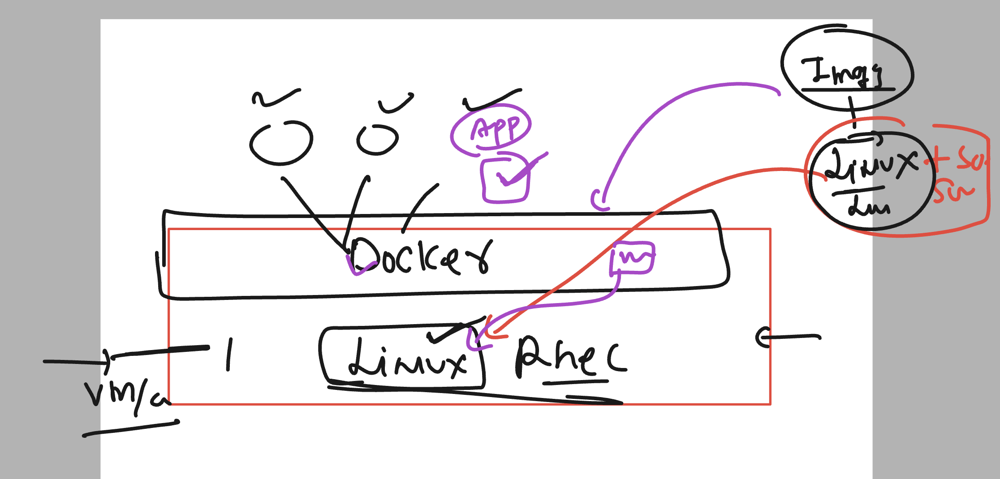
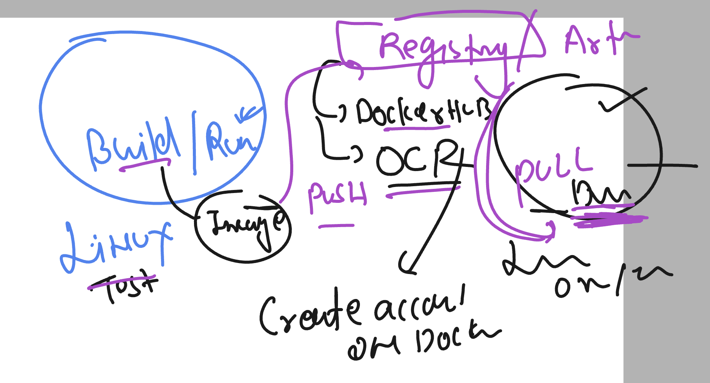
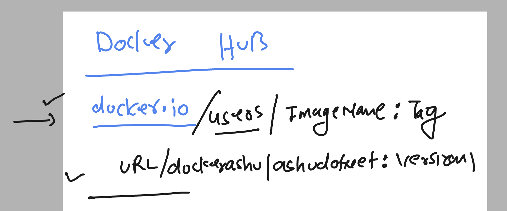
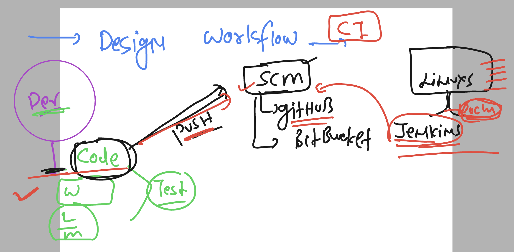
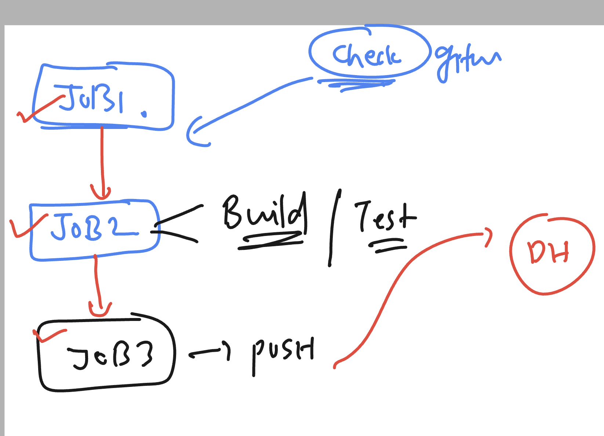

# linux-dotnet-vodafone

### Revision 


### understanding concept of docker images


### docker images 



### checking docker images in linux server 

```
[ashu@docker-server ~]$ docker  images
REPOSITORY   TAG       IMAGE ID   CREATED   SIZE
[ashu@docker-server ~]$ 


```

### download images from docker hub 

```
 docker  pull  openjdk 
Using default tag: latest
latest: Pulling from library/openjdk
197c1adcd755: Pull complete 
57b698b7af4b: Pull complete 
95a27dbe0150: Pull complete 
Digest: sha256:9b448de897d211c9e0ec635a485650aed6e28d4eca1efbc34940560a480b3f1f
Status: Downloaded newer image for openjdk:latest
docker.io/library/openjdk:latest
[ashu@docker-server ~]$ 
[ashu@docker-server ~]$ docker  images
REPOSITORY   TAG       IMAGE ID       CREATED         SIZE
openjdk      latest    71260f256d19   10 months ago   470MB
[ashu@docker-server ~]$ 


```

### all about images

```
docker pull oraclelinux:8.8 
8.8: Pulling from library/oraclelinux
6f1712686323: Pull complete 
Digest: sha256:88ef30e616a2a46506b3096c81e5db6dca7ee133ddb1ca155e5592a46df23a56
Status: Downloaded newer image for oraclelinux:8.8
docker.io/library/oraclelinux:8.8
[ashu@docker-server ~]$ docker images
REPOSITORY           TAG       IMAGE ID       CREATED         SIZE
python               latest    58a8f3dcd68a   6 days ago      1.02GB
oraclelinux          8.8       0f6366212b2c   7 days ago      238MB
bitnami/dotnet-sdk   latest    fe5a17dea20b   11 days ago     1.08GB
openjdk              latest    71260f256d19   10 months ago   470MB
[ashu@docker-server ~]$ 

```

### final image 

```
docker pull redhat/ubi8
Using default tag: latest
latest: Pulling from redhat/ubi8
b4e744f5f131: Pull complete 
Digest: sha256:449da7f8f2ef6285a8445a1e31af57a97b9dae5dcf009b1629c59742c89c68c3
Status: Downloaded newer image for redhat/ubi8:latest
docker.io/redhat/ubi8:latest
[ashu@docker-server ~]$ docker  images
REPOSITORY           TAG       IMAGE ID       CREATED         SIZE
python               latest    58a8f3dcd68a   6 days ago      1.02GB
oraclelinux          8.8       0f6366212b2c   7 days ago      238MB
bitnami/dotnet-sdk   latest    fe5a17dea20b   11 days ago     1.08GB
redhat/ubi8          latest    86b358a425da   6 weeks ago     205MB
openjdk              latest    71260f256d19   10 months ago   470MB
```

### Creating first container 

```
[ashu@docker-server ~]$ docker  run   --name  ashuc1  -it -d  redhat/ubi8:latest    
d0c6c7de102d2274620db8189ab4635d32bf58dd193e6421d0834246c9bbb26c

=====>>  to list all the running containers

[ashu@docker-server ~]$ docker   ps
CONTAINER ID   IMAGE                COMMAND       CREATED         STATUS         PORTS     NAMES
d0c6c7de102d   redhat/ubi8:latest   "/bin/bash"   8 seconds ago   Up 7 seconds             ashuc1
[ashu@docker-server ~]$ 

```

### stop and remove containers 

```
[ashu@docker-server ~]$ docker  stop  ashuc1
ashuc1
[ashu@docker-server ~]$ docker  rm ashuc1
ashuc1
[ashu@docker-server ~]$ 

```

## app containerization -- 


### taking sample dotnet webapp code

```
git clone https://github.com/redashu/sample-dotnetweb-app.git
```

### creating dockerfile

```
[ashu@docker-server ashu-docker-apps]$ ls
sample-dotnetweb-app
[ashu@docker-server ashu-docker-apps]$ touch  Dockerfile
[ashu@docker-server ashu-docker-apps]$ ls
Dockerfile  sample-dotnetweb-app
```

### adding content in dockerfile

```
FROM redhat/ubi8  
# we are using redhat 8 image from docker hub
# if this image is not available in docker server it will pull it
RUN dnf install dotnet-sdk-8.0 -y  
RUN mkdir /ashuapp 
# uses to run any command during docker build time
COPY sample-dotnetweb-app /ashuapp/
# we are copying code from folder to inside docker image 
WORKDIR /ashuapp
# we are changing directory like cd command in linux / windows
RUN dotnet build -o ashubin
# we are building / compiling dotnet sample app
CMD ./ashubin/ashu-webapp  --urls=http://0.0.0.0:5000
# must be the final keyword of dockerfile which will run your app

```

### lets build image

```
ashu@docker-server ashu-docker-apps]$ ls
Dockerfile  sample-dotnetweb-app
[ashu@docker-server ashu-docker-apps]$ docker  build -t  ashudotnet:appv1  . 
Sending build context to Docker daemon  9.172MB
Step 1/7 : FROM redhat/ubi8
 ---> 86b358a425da
Step 2/7 : RUN dnf install dotnet-sdk-8.0 -y
 ---> Running in b56bf98dfb1c
Updating Subscription Management repositories.
Unable to read consumer identity
```

## lets create container from the image 

```
[ashu@docker-server ashu-docker-apps]$ docker  images
REPOSITORY       TAG       IMAGE ID       CREATED          SIZE
madhuridotnet    appv1     28c214b19249   7 minutes ago    926MB
anujdotnetapp1   appv1     108030db1619   7 minutes ago    926MB
shaileshdotnet   appv1     d291799707de   10 minutes ago   926MB
vijaydotnet      appv1     a6f26e51386e   11 minutes ago   926MB
poojadotnet      appv1     d32441783b9f   11 minutes ago   926MB
ashudotnet       appv1     3ffb20e60a06   14 minutes ago   926MB
redhat/ubi8      latest    86b358a425da   6 weeks ago      205MB

====> creating contaienr 
[ashu@docker-server ashu-docker-apps]$ 
[ashu@docker-server ashu-docker-apps]$ docker   run --name ashuapp  -itd  ashudotnet:appv1 
2786c9f8914af53052a605652551a0e99935ed030c9f004ecae029b560a1aade

====> checking status 
[ashu@docker-server ashu-docker-apps]$ docker   ps
CONTAINER ID   IMAGE              COMMAND                  CREATED         STATUS         PORTS     NAMES
2786c9f8914a   ashudotnet:appv1   "/bin/sh -c './ashub…"   3 seconds ago   Up 3 seconds             ashuapp

>>> ==== app status 
[ashu@docker-server ashu-docker-apps]$ docker logs  ashuapp
warn: Microsoft.AspNetCore.DataProtection.KeyManagement.XmlKeyManager[35]
      No XML encryptor configured. Key {52c9b7f4-45ba-4295-9d5f-ad2cab6581c5} may be persisted to storage in unencrypted form.
info: Microsoft.Hosting.Lifetime[14]
      Now listening on: http://0.0.0.0:5000
info: Microsoft.Hosting.Lifetime[0]
      Application started. Press Ctrl+C to shut down.
info: Microsoft.Hosting.Lifetime[0]
      Hosting environment: Production
info: Microsoft.Hosting.Lifetime[0]
      Content root path: /ashuapp
```

### access container from docker server (linux machine )---

```
====>> LInux server 
ashu@docker-server ~]$ whoami
ashu
[ashu@docker-server ~]$ cat  /etc/os-release 
NAME="Amazon Linux"
VERSION="2"
ID="amzn"
ID_LIKE="centos rhel fedora"
VERSION_ID="2"
PRETTY_NAME="Amazon Linux 2"
ANSI_COLOR="0;33"
CPE_NAME="cpe:2.3:o:amazon:amazon_linux:2"
HOME_URL="https://amazonlinux.com/"
SUPPORT_END="2025-06-30"

====>> checking container listing 
[ashu@docker-server ~]$ 
[ashu@docker-server ~]$ 
[ashu@docker-server ~]$ docker  ps
CONTAINER ID   IMAGE                  COMMAND                  CREATED          STATUS          PORTS     NAMES
69991f429725   vijaydotnet:appv1      "/bin/sh -c './vijay…"   4 minutes ago    Up 4 minutes              vijayapp
adb918690143   anujdotnetapp1:appv1   "/bin/sh -c './anuja…"   5 minutes ago    Up 5 minutes              anujapp
e1531fd8f3e8   madhuridotnet:appv1    "/bin/sh -c './madhu…"   7 minutes ago    Up 7 minutes              madhuriapp
2786c9f8914a   ashudotnet:appv1       "/bin/sh -c './ashub…"   10 minutes ago   Up 10 minutes             ashuapp
[ashu@docker-server ~]$


====>>> accessing container

[ashu@docker-server ~]$ docker   exec -it  ashuapp bash 
[root@2786c9f8914a ashuapp]# 
[root@2786c9f8914a ashuapp]# 
[root@2786c9f8914a ashuapp]# whoami
root
[root@2786c9f8914a ashuapp]# cat  /etc/os-release 
NAME="Red Hat Enterprise Linux"
VERSION="8.9 (Ootpa)"
ID="rhel"
ID_LIKE="fedora"
VERSION_ID="8.9"
PLATFORM_ID="platform:el8"
PRETTY_NAME="Red Hat Enterprise Linux 8.9 (Ootpa)"
ANSI_COLOR="0;31"
CPE_NAME="cpe:/o:redhat:enterprise_linux:8::baseos"
HOME_URL="https://www.redhat.com/"
DOCUMENTATION_URL="https://access.redhat.com/documentation/en-us/red_hat_enterprise_linux/8"
BUG_REPORT_URL="https://bugzilla.redhat.com/"

REDHAT_BUGZILLA_PRODUCT="Red Hat Enterprise Linux 8"
REDHAT_BUGZILLA_PRODUCT_VERSION=8.9
REDHAT_SUPPORT_PRODUCT="Red Hat Enterprise Linux"
REDHAT_SUPPORT_PRODUCT_VERSION="8.9"

====>> exiting from container 
[root@2786c9f8914a ashuapp]# exit
exit

```

### pushing image to registry / artifacts



### image push to docker hub -- Image name format 



## steps to push image to docker hub 

### change image name to docker hub format 

```
[ashu@docker-server ashu-docker-apps]$ docker  images
REPOSITORY       TAG       IMAGE ID       CREATED             SIZE
poojadotnet      appv1     e824556a0b47   About an hour ago   926MB
madhuridotnet    appv1     28c214b19249   2 hours ago         926MB
anujdotnetapp1   appv1     108030db1619   2 hours ago         926MB
shaileshdotnet   appv1     d291799707de   2 hours ago         926MB
vijaydotnet      appv1     a6f26e51386e   2 hours ago         926MB
<none>           <none>    d32441783b9f   2 hours ago         926MB
ashudotnet       appv1     3ffb20e60a06   2 hours ago         926MB
redhat/ubi8      latest    86b358a425da   6 weeks ago         205MB
[ashu@docker-server ashu-docker-apps]$ 
[ashu@docker-server ashu-docker-apps]$ 
[ashu@docker-server ashu-docker-apps]$ docker  tag   ashudotnet:appv1    docker.io/dockerashu/ashudotnet:version1 
[ashu@docker-server ashu-docker-apps]$ 


```

### login to docker hub account from docker server 

```
docker  login 
Login with your Docker ID to push and pull images from Docker Hub. If you don't have a Docker ID, head over to https://hub.docker.com to create one.
Username: dockerashu
Password: 
WARNING! Your password will be stored unencrypted in /home/ashu/.docker/config.json.
Configure a credential helper to remove this warning. See
https://docs.docker.com/engine/reference/commandline/login/#credentials-store

Login Succeeded
```

### pushing image

```
ashu@docker-server ashu-docker-apps]$ docker  push  docker.io/dockerashu/ashudotnet:version1 
The push refers to repository [docker.io/dockerashu/ashudotnet]
ab88a3ddab78: Pushed 
```

### making process of automation for docker steps 




### Creaitng jobs in jenkins 




