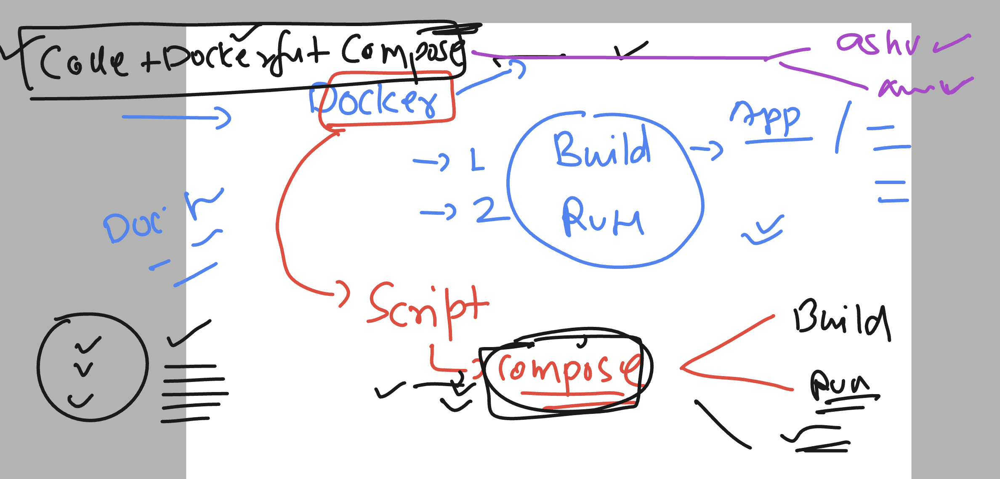
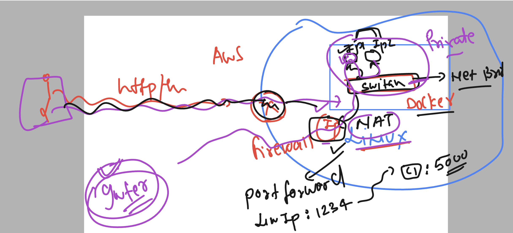
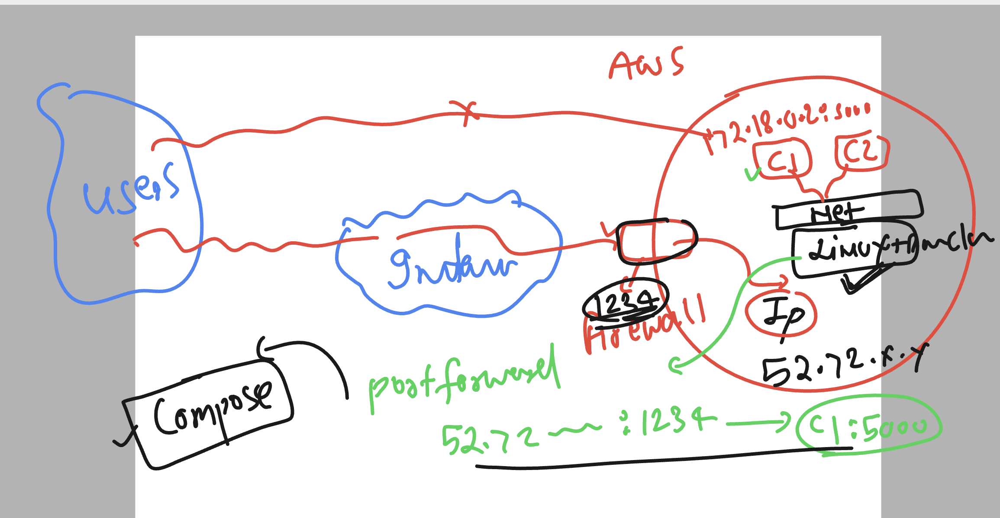

# linux-dotnet-vodafone

### understanding dotnet in linux server as well as in docker container 


### Introduction to docker compose 


  
### final dockerfile for dotnet core webapp

```
FROM redhat/ubi8  
LABEL name="ashutoshh"
LABEL email="ashutoshh@linux.com"
# label is optional but to share image owner details to users 
RUN dnf install dotnet-sdk-8.0 -y  
RUN mkdir /ashuapp 
COPY sample-dotnetweb-app /ashuapp/
WORKDIR /ashuapp
RUN dotnet build -o ashubin 
RUN dotnet publish -o ashu_publish -p:AssemblyName=ashudotnet
# while publish i can change the name of app
CMD ./ashu_publish/ashudotnet --urls=http://0.0.0.0:5000
# must be the final keyword of dockerfile which will run your app

```

### adding compose file here

```
version: '3.8'
services: # apps containers you want to build and run
  ashuapp1: # name of appliction for compose 
    image: ashudotnetimg:v1  # image i want to build 
    build: .  # path of dockerfile location -- . means current 
    container_name: ashuc1 # it will create container also 
  

```

### run docker-compose.yaml file 

```
[ashu@docker-server ashu-docker-apps]$ ls
docker-compose.yaml  Dockerfile  prod-grade-dotnet  sample-dotnetweb-app

[ashu@docker-server ashu-docker-apps]$ docker-compose   up -d 
[+] Running 1/1
 ! ashuapp1 Warning                                                                                                  0.1s 
[+] Building 25.1s (13/13) FINISHED                                                                        docker:default
 => [ashuapp1 internal] load build definition from Dockerfile                                                        0.0s
 => => transferring dockerfile: 546B                                                                                 0.0s
 => [ashuapp1 internal] load .dockerignore                                                                           0.0s
 => => transferring context: 2B                                                                                      0.0s
 => [ashuapp1 internal] load metadata for docker.io/redhat/ubi8:latest                                               0.3s
 => [ashuapp1 auth] redhat/ubi8:pull token for registry-1.docker.io                                                  0.0s
 => [ashuapp1 1/7] FROM docker.io/redhat/ubi8@sha256:449da7f8f2ef6285a8445a1e31af57a97b9dae5dcf009b1629c59742c89c68  0.0s
 => => resolve docker.io/redhat/ubi8@sha256:449da7f8f2ef6285a8445a1e31af57a97b9dae5dcf009b1629c59742c89c68c3         0.0s
 => [ashuapp1 internal] load build context                                                                           0.1s
 => => transferring context: 9.08MB                                                                                  0.1s
 => CACHED [ashuapp1 2/7] RUN dnf install dotnet-sdk-8.0 -y                                                          0.0s
 => CACHED [ashuapp1 3/7] RUN mkdir /ashuapp                                                                         0.0s
 => CACHED [ashuapp1 4/7] COPY sample-dotnetweb-app /ashuapp/                                                        0.0s
 => CACHED [ashuapp1 5/7] WORKDIR /ashuapp                                                                           0.0s
 => [ashuapp1 6/7] RUN dotnet build -o ashubin                                                                      13.4s
 => [ashuapp1 7/7] RUN dotnet publish -o ashu_publish -p:AssemblyName=ashudotnet                                    11.0s 
 => [ashuapp1] exporting to image                                                                                    0.2s 
 => => exporting layers                                                                                              0.2s 
 => => writing image sha256:9f75026c642c46d2fff8bb0ed77b816c141ba3e7ed1542f6a3fac82bd6417f41                         0.0s 
 => => naming to docker.io/library/ashudotnetimg:v1                                                                  0.0s 
[+] Running 2/2                                                                                                           
 ✔ Network ashu-docker-apps_default  Created                                                                         0.1s 
 ✔ Container ashuc1                  Started     
```

### checking more things 

```
[ashu@docker-server ashu-docker-apps]$ docker-compose   ps
NAME      IMAGE              COMMAND                  SERVICE    CREATED          STATUS          PORTS
ashuc1    ashudotnetimg:v1   "/bin/sh -c './ashu_…"   ashuapp1   55 seconds ago   Up 54 seconds   
[ashu@docker-server ashu-docker-apps]$ docker-compose   images
CONTAINER           REPOSITORY          TAG                 IMAGE ID            SIZE
ashuc1              ashudotnetimg       v1                  9f75026c642c        935MB
[ashu@docker-server ashu-docker-apps]$ 

```

### Networking concept in docker containers 



### portward in docker container 



### adding port forwarding to container 

```
version: '3.8' 
services: # apps containers you want to build and run
  ashuapp1: # name of appliction for compose 
    image: ashudotnetimg:v1  # image i want to build 
    build: .  # path of dockerfile location -- . means current 
    container_name: ashuc1 # it will create container also 
    ports:
      - 1234:5000  # left side port you can choose in 1024 - 60000
    # in linux server IP:1234 port will start listening and it will
    # forward request to ashuc1 contaienr on 5000 port 
  

```

### rerun docker compose file

```
[ashu@docker-server ashu-docker-apps]$ ls
docker-compose.yaml  Dockerfile  prod-grade-dotnet  sample-dotnetweb-app
[ashu@docker-server ashu-docker-apps]$ docker-compose  up -d
[+] Running 1/1
 ✔ Container ashuc1  Started                                                                                         0.2s 
[ashu@docker-server ashu-docker-apps]$ docker-compose  ps
NAME      IMAGE              COMMAND                  SERVICE    CREATED          STATUS         PORTS
ashuc1    ashudotnetimg:v1   "/bin/sh -c './ashu_…"   ashuapp1   10 seconds ago   Up 9 seconds   0.0.0.0:1234->5000/tcp, :::1234->5000/tcp
[ashu@docker-server ashu-docker-apps]$ 


```

### creating dockerfile for apache httpd and adding virtualhost config also 

### dockerfile

```
FROM redhat/ubi8  
LABEL name="ashutoshh"
LABEL email="ashutoshh@linux.com"
# label is optional but to share image owner details to users 
RUN dnf install httpd -y 
COPY  dotnet-vhost.conf  /etc/httpd/conf.d/dotnet.conf 
#CMD systemctl start httpd
ENTRYPOINT  httpd -DFOREGROUND 
# Replace of cmd and better than cmd 
```

### vhostfile

```
<virtualhost *:80>
    servername localhost
    ProxyPass /  http://ashuc1:5000/
	ProxyPassReverse / http://ashuc1:5000/
</virtualhost>
```

### adding things in docker-compose.yaml

```
version: '3.8' 
services: # apps containers you want to build and run
  ashuapp1: # name of appliction for compose 
    image: ashudotnetimg:v1  # image i want to build 
    build: .  # path of dockerfile location -- . means current 
    container_name: ashuc1 # it will create container also 
  ashuapp2: 
    image: ashuhttpd:v1 
    build: 
      context: . #location of dockerfile 
      dockerfile: httpd.dockerfile # name of dockerfile 
    container_name: ashuc2 
    ports:
      - 1234:80  
  

```

### running compose 

```
ashu@docker-server ashu-docker-apps]$ docker-compose down
[+] Running 2/2
 ✔ Container ashuc1                  Removed                                                                         0.3s 
 ✔ Network ashu-docker-apps_default  Removed                                                                         0.1s 
[ashu@docker-server ashu-docker-apps]$ docker-compose up -d --build 
[+] Building 10.9s (17/17) FINISHED                                                                        docker:default
 => [ashuapp1 internal] load build definition from Dockerfile                                                        0.0s
 => => transferring dockerfile: 32B                                                                                  0.0s
 => [ashuapp2 internal] load build definition from httpd.dockerfile                                                  0.0s
 => => transferring dockerfile: 362B                                                                                 0.0s
 => [ashuapp2 internal] load .dockerignore                                                                           0.0s
 => => transferring context: 2B                                                                                      0.0s
 => [ashuapp1 internal] load .dockerignore                                                                           0.0s
 => => transferring context: 2B             
```

### checking it

```
[ashu@docker-server ashu-docker-apps]$ docker-compose  ps
NAME      IMAGE              COMMAND                  SERVICE    CREATED          STATUS          PORTS
ashuc1    ashudotnetimg:v1   "/bin/sh -c './ashu_…"   ashuapp1   24 seconds ago   Up 23 seconds   
ashuc2    ashuhttpd:v1       "/bin/sh -c 'httpd -…"   ashuapp2   24 seconds ago   Up 23 seconds   0.0.0.0:1234->80/tcp, :::1234->80/tcp
```

### more docker-compose commands

```
ashu-customer1-app git:(master) docker-compose down
[+] Running 3/2
 ✔ Container ashuc1                    Removed                                                                                                          0.4s 
 ✔ Container ashuc2                    Removed                                                                                                          0.4s 
 ✔ Network ashu-customer1-app_default  Removed                                                                                                          0.0s 
➜  ashu-customer1-app git:(master) docker-compose up -d
[+] Building 0.0s (0/0)                                                                                                                                      
[+] Running 3/3
 ✔ Network ashu-customer1-app_default  Created                                                                                                          0.0s 
 ✔ Container ashuc1                    Started                                                                                                          0.4s 
 ✔ Container ashuc2                    Started                                                                                                          0.4s 
➜  ashu-customer1-app git:(master) docker-compose ps   
NAME                IMAGE               COMMAND                  SERVICE             CREATED             STATUS              PORTS
ashuc1              ashudotnetimg:v1    "/bin/sh -c './ashu_…"   ashuapp1            3 seconds ago       Up 2 seconds        
ashuc2              ashuhttpd:v1        "/bin/sh -c 'httpd -…"   ashuapp2            3 seconds ago       Up 2 seconds        0.0.0.0:1234->80/tcp
➜  ashu-customer1-app git:(master) docker-compose stop 
[+] Stopping 2/2
 ✔ Container ashuc1  Stopped                                                                                                                            0.2s 
 ✔ Container ashuc2  Stopped                                                                                                                            0.2s 
➜  ashu-customer1-app git:(master) docker-compose ps -a
NAME                IMAGE               COMMAND                  SERVICE             CREATED             STATUS                     PORTS
ashuc1              ashudotnetimg:v1    "/bin/sh -c './ashu_…"   ashuapp1            12 seconds ago      Exited (0) 2 seconds ago   
ashuc2              ashuhttpd:v1        "/bin/sh -c 'httpd -…"   ashuapp2            12 seconds ago      Exited (0) 2 seconds ago   
➜  ashu-customer1-app git:(master) docker-compose start
[+] Running 2/2
 ✔ Container ashuc2  Started                                                                                                                            0.5s 
 ✔ Container ashuc1  Started                                                                                                                            0.5s 
➜  ashu-customer1-app git:(master) docker-compose ps   
NAME                IMAGE               COMMAND                  SERVICE             CREATED             STATUS              PORTS
ashuc1              ashudotnetimg:v1    "/bin/sh -c './ashu_…"   ashuapp1            19 seconds ago      Up 2 seconds        
ashuc2              ashuhttpd:v1        "/bin/sh -c 'httpd -…"   ashuapp2            19 seconds ago      Up 2 seconds        0.0.0.0:1234->80/tcp
➜  ashu-customer1-app git:(master) 

```


