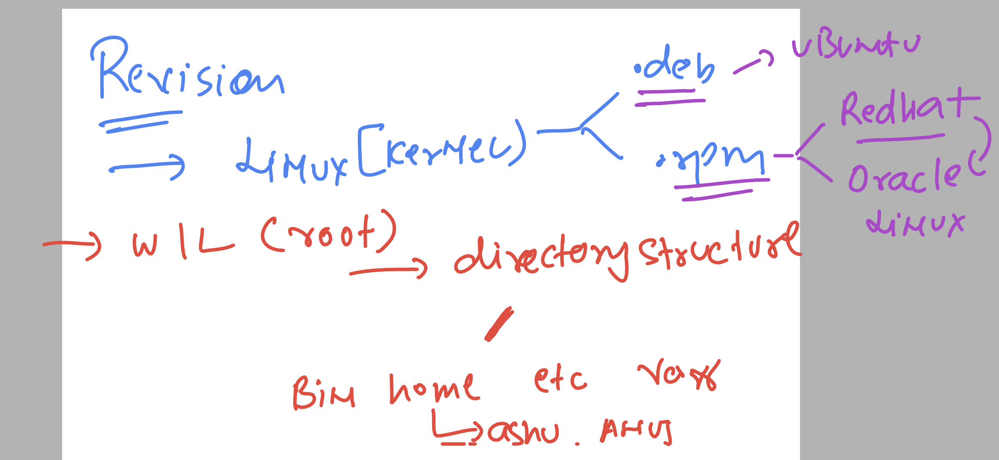
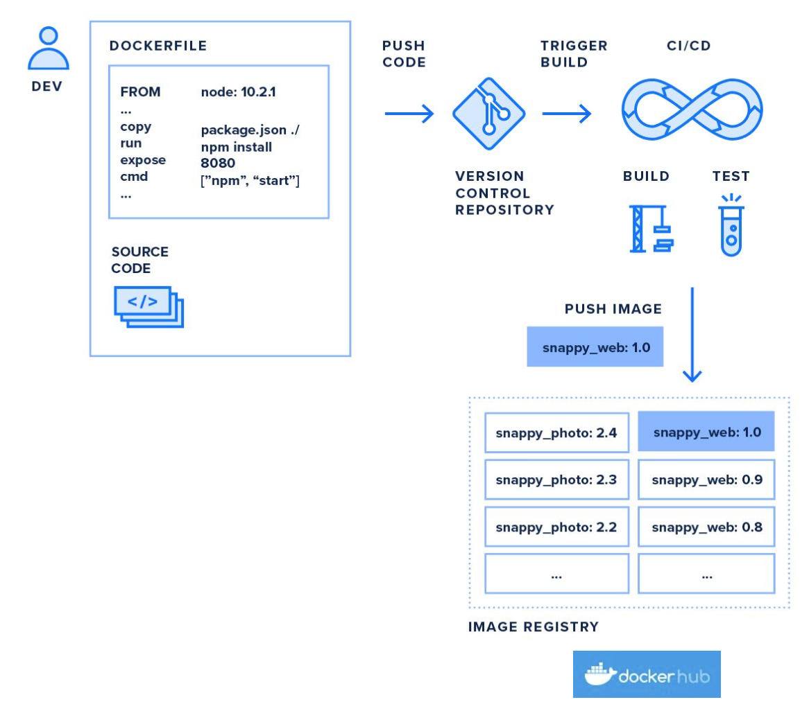
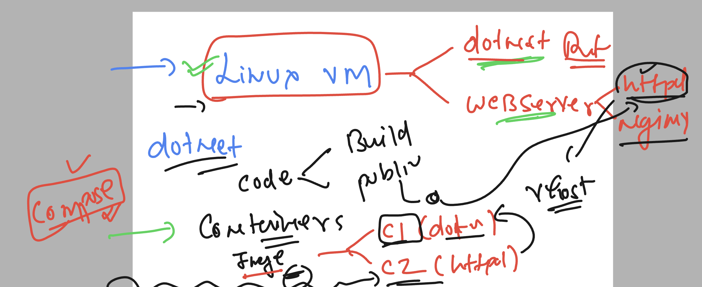

# linux-dotnet-vodafone
## overall Revision 

### Linux basic



### checking docker version 

```
ashu@ip-172-31-87-20 ~]$ docker  version 
Client:
 Version:           20.10.25
 API version:       1.41
 Go version:        go1.20.10
 Git commit:        b82b9f3
 Built:             Fri Oct 13 22:46:12 2023
 OS/Arch:           linux/amd64
 Context:           default
 Experimental:      true

Server:
 Engine:
  Version:          20.10.25
  API version:      1.41 (minimum version 1.12)
  Go version:       go1.20.10
  Git commit:       5df983c
  Built:            Fri Oct 13 22:46:59 2023
  OS/Arch:          linux/amd64
  Experimental:     false
 containerd:
  Version:          1.7.2
  GitCommit:        0cae528dd6cb557f7201036e9f43420650207b58
 runc:
  Version:          1.1.7
  GitCommit:        f19387a6bec4944c770f7668ab51c4348d9c2f38
 docker-init:
  Version:          0.19.0
  GitCommit:        de40ad0

```

### what is process of app testing or deployment using docker 



### linux vm to linux containers -- understanding for dotnet core app



### dotnet app image build and create using compose 

```
[ashu@ip-172-31-87-20 ashu-apps]$ ls
ashu-customer1-app  python-test
[ashu@ip-172-31-87-20 ashu-apps]$ cd ashu-customer1-app/
[ashu@ip-172-31-87-20 ashu-customer1-app]$ ls
docker-compose.yaml  Dockerfile  dotnet-vhost.conf  httpd.dockerfile  README.md  sample-dotnetweb-app

=====>>
[ashu@ip-172-31-87-20 ashu-customer1-app]$ docker-compose up -d --build 
[+] Building 12.7s (10/11)                                                                                 docker:default
 => [ashuapp1 internal] load build definition from Dockerfile                                                        0.0s
 => => transferring dockerfile: 546B                                                                                 0.0s
 => [ashuapp1 internal] load .dockerignore                                                                           0.0s
 => => transferring context: 2B                                                                                      0.0s
 => [ashuapp1 internal] load metadata for docker.io/redhat/ubi8:latest                                               0.1s
 => [ashuapp1 1/7] FROM docker.io/redhat/ubi8@sha256:449da7f8f2ef6285a8445a1e31af57a97b9dae5dcf009b1629c59742c89c68  0.0s
 => [ashuapp1 internal] load build context                                                                           0.1s
 => => transferring context: 8.16MB                            
```

### verify 

```
[ashu@ip-172-31-87-20 ashu-customer1-app]$ docker-compose ps
NAME      IMAGE              COMMAND                  SERVICE    CREATED          STATUS          PORTS
ashuc1    ashudotnetimg:v1   "/bin/sh -c './ashu_…"   ashuapp1   36 seconds ago   Up 35 seconds   
[ashu@ip-172-31-87-20 ashu-customer1-app]$ 
[ashu@ip-172-31-87-20 ashu-customer1-app]$ 
[ashu@ip-172-31-87-20 ashu-customer1-app]$ docker-compose images
CONTAINER           REPOSITORY          TAG                 IMAGE ID            SIZE
ashuc1              ashudotnetimg       v1                  03343783a7bf        934MB
```

### after adding dotnet and httpd container lets test it 

```
[ashu@ip-172-31-87-20 ashu-customer1-app]$ docker-compose  down 
[+] Running 2/2
 ✔ Container ashuc1                    Removed                                                                       0.2s 
 ✔ Network ashu-customer1-app_default  Removed


====>>>                                                                  0.1s 
[ashu@ip-172-31-87-20 ashu-customer1-app]$ docker-compose up -d --build 
[+] Building 0.5s (17/17) FINISHED                                                                         docker:default
 => [ashuapp1 internal] load build definition from Dockerfile                                                        0.0s
 => => transferring dockerfile: 32B                                                                                  0.0s
 => [ashuapp1 internal] load .dockerignore                                                                           0.0s
 => => transferring context: 2B                                                                                      0.0s
 => [ashuapp2 internal] load metadata for docker.io/redhat/ubi8:latest                                               0.2s
 => [ashuapp2 1/3] FROM docker.io/redhat/ubi8@sha256:449da7f8f2ef6285a8445a1e31af57a97b9dae5dcf009b1629c59742c89c68  0.0s
 => [ashuapp1 internal] load build context                                                                           0.0s
 => => transferring context: 8.19kB                                                                                  0.0s
 => CACHED [ashuapp1 2/7] RUN dnf install dotnet-sdk-8.0 -y                                                          0.0s
 => CACHED [ashuapp1 3/7] RUN mkdir /ashuapp                                                                         0.0s
 => CACHED [ashuapp1 4/7] COPY sample-dotnetweb-app /ashuapp/                                                        0.0s
 => CACHED [ashuapp1 5/7] WORKDIR /ashuapp                                                                           0.0s
 => CACHED [ashuapp1 6/7] RUN dotnet build -o ashubin                                                                0.0s
 => CACHED [ashuapp1 7/7] RUN dotnet publish -o ashu_publish -p:AssemblyName=ashudotnet                              0.0s
 => [ashuapp2] exporting to image                                                                                    0.0s
 => => exporting layers                                                                                              0.0s
 => => writing image sha256:03343783a7bfd31a8762467618c2579fa1c84a9d7cd15169b80c35039cbea6b2                         0.0s
 => => naming to docker.io/library/ashudotnetimg:v1                                                                  0.0s
 => => writing image sha256:fa08eb434bfccb15530a760dc0adc5eb4ee2b27e9766743779a9825cc2a6e38b                         0.0s
 => => naming to docker.io/library/ashuhttpd:version1                                                                0.0s
 => [ashuapp2 internal] load build definition from ashuhttpd.dockerfile                                              0.0s
 => => transferring dockerfile: 366B                                                                                 0.0s
 => [ashuapp2 internal] load .dockerignore                                                                           0.0s
 => => transferring context: 2B                                                                                      0.0s
 => [ashuapp2 internal] load build context                                                                           0.0s
 => => transferring context: 181B                                                                                    0.0s
 => CACHED [ashuapp2 2/3] RUN dnf install httpd -y                                                                   0.0s
 => [ashuapp2 3/3] COPY  dotnet-vhost.conf  /etc/httpd/conf.d/dotnet.conf                                            0.0s
[+] Running 3/3
 ✔ Network ashu-customer1-app_default  Created                                                                       0.0s 
 ✔ Container ashuc1                    Started                                                                       0.0s 
 ✔ Container ashuc2                    Started


=====>>                                                                    0.0s 
[ashu@ip-172-31-87-20 ashu-customer1-app]$ docker-compose ps
NAME      IMAGE                COMMAND                  SERVICE    CREATED          STATUS         PORTS
ashuc1    ashudotnetimg:v1     "/bin/sh -c './ashu_…"   ashuapp1   10 seconds ago   Up 9 seconds   
ashuc2    ashuhttpd:version1   "/bin/sh -c 'httpd -…"   ashuapp2   10 seconds ago   Up 8 seconds   0.0.0.0:1234->80/tcp, :::1234->80/tcp
[ashu@ip-172-31-87-20 ashu-customer1-app]$ 
```


### executing same thing with jenkins for automated build and test

## jenkinsfile -- test case 1

```
pipeline {
    agent any

    stages {
        stage('taking source code from github') {
            steps {
                echo 'cloning source code to jenkins server'
                git 'https://github.com/redashu/ashu-customer1-app.git'
                // running linux command 
                sh 'ls'
            }
        }
    }
}

```

### testing docker with jenkins 

```
pipeline {
    agent any

    stages {
        stage('taking source code from github') {
            steps {
                echo 'cloning source code to jenkins server'
                git 'https://github.com/redashu/ashu-customer1-app.git'
                // running linux command 
                sh 'ls'
            }
        }
        // stage for checking jenkins connection with docker 
        stage('testing docker connection from jenkins'){
            steps {
                echo 'lets check docker with jenkins'
                sh 'docker version'
                sh 'docker-compose version'
            }
        }
    }
}

```

### Note: if jenkins and docker is running in same system 

```
 usermod -aG docker jenkins
```

### if still not connecting -- as backup plan 

```
chmod 777 /var/run/docker.sock 
```


### adding stage to run compsoe file

```
pipeline {
    agent any

    stages {
        stage('taking source code from github') {
            steps {
                echo 'cloning source code to jenkins server'
                git 'https://github.com/redashu/ashu-customer1-app.git'
                // running linux command 
                sh 'ls'
            }
        }
        // stage for checking jenkins connection with docker 
        stage('testing docker connection from jenkins'){
            steps {
                echo 'lets check docker with jenkins'
                sh 'docker version'
                sh 'docker-compose version'
            }
        }
        // running compose file to build images and create container 
        stage('running docker-compose file'){
            steps {
                echo 'running compose'
                sh 'docker-compose down'
                sh 'docker-compose up -d --build'
                sh 'docker-compose ps'
                sh 'docker-compose images'
            }
        }
    }
}

```

### adding dotnet and httpd container app testing 

```
pipeline {
    agent any

    stages {
        stage('taking source code from github') {
            steps {
                echo 'cloning source code to jenkins server'
                git 'https://github.com/redashu/ashu-customer1-app.git'
                // running linux command 
                sh 'ls'
            }
        }
        // stage for checking jenkins connection with docker 
        stage('testing docker connection from jenkins'){
            steps {
                echo 'lets check docker with jenkins'
                sh 'docker version'
                sh 'docker-compose version'
            }
        }
        // running compose file to build images and create container 
        stage('running docker-compose file'){
            steps {
                echo 'running compose'
                sh 'docker-compose down'
                sh 'docker-compose up -d --build'
                sh 'docker-compose ps'
                sh 'docker-compose images'
            }
        }
        // app access stage for dotnet container 
        stage('dotnet app test'){
            steps {
                echo 'using curl tool to access container1 app'
                sh 'curl -f http://localhost:1122'
            }
        }
        // httpd webserver testing 
        stage('httpd container app test'){
            steps {
                echo 'using curl again'
                sh 'curl -f http://localhost:1234'
            }
        }
    }
}

```

