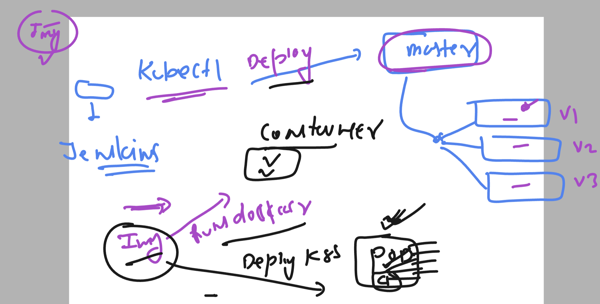
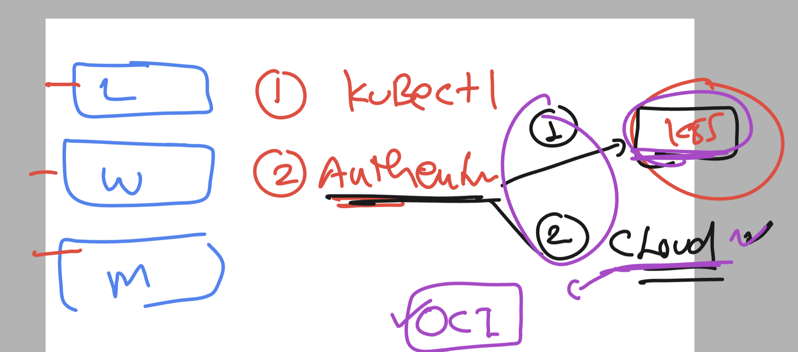

# linux-dotnet-vodafone

### Dotnet app with Loadbalancer case 

## we are having 2 server lets do the same thing in both server 

# server 1 

### Install dotnet and httpd -- RHEL 8/9 

```
 [ec2-user@server1 ~]$ pwd
/home/ec2-user
[ec2-user@server1 ~]$ sudo -i
[root@server1 ~]# whoami
root
[root@server1 ~]# cd  /opt/
[root@server1 opt]# ls
[root@server1 opt]# git clone https://github.com/redashu/ashu-customer1-app.git
Cloning into 'ashu-customer1-app'...
remote: Enumerating objects: 122, done.
remote: Counting objects: 100% (122/122), done.
remote: Compressing objects: 100% (78/78), done.
remote: Total 122 (delta 41), reused 108 (delta 35), pack-reused 0
Receiving objects: 100% (122/122), 863.23 KiB | 20.55 MiB/s, done.
Resolving deltas: 100% (41/41), done.
[root@server1 opt]# 


```

### checking app code 

```
[root@server1 sample-dotnetweb-app]# pwd
/opt/ashu-customer1-app/sample-dotnetweb-app
[root@server1 sample-dotnetweb-app]# ls
appsettings.Development.json  ashu-webapp.csproj  Models  Program.cs  README.md  wwwroot
appsettings.json              Controllers         obj     Properties  Views
[root@server1 sample-dotnetweb-app]# 


```

### Disable firewalld in local rhel server
```
sudo systemctl disable --now  firewalld
```

### how to check ports used by linux server

```
[root@server1 system]# netstat -nlpt
Active Internet connections (only servers)
Proto Recv-Q Send-Q Local Address           Foreign Address         State       PID/Program name    
tcp        0      0 127.0.0.1:81            0.0.0.0:*               LISTEN      669/ashu-webapp     
tcp        0      0 0.0.0.0:22              0.0.0.0:*               LISTEN      1032/sshd: /usr/sbi 
tcp        0      0 0.0.0.0:82              0.0.0.0:*               LISTEN      2624/ashu-webapp    
tcp6       0      0 ::1:81                  :::*                    LISTEN      669/ashu-webapp     
tcp6       0      0 :::22                   :::*                    LISTEN      1032/sshd: /usr/sbi 
tcp6       0      0 :::80                   :::*                    LISTEN      2322/httpd          
[root@server1 system]# 
[root@server1 system]# 
[root@server1 system]# ss -nlpt
State       Recv-Q      Send-Q           Local Address:Port           Peer Address:Port     Process                                      
LISTEN      0           512                  127.0.0.1:81                  0.0.0.0:*         users:(("ashu-webapp",pid=669,fd=266))      
LISTEN      0           128                    0.0.0.0:22                  0.0.0.0:*         users:(("sshd",pid=1032,fd=3))              
LISTEN      0           512                    0.0.0.0:82                  0.0.0.0:*         users:(("ashu-webapp",pid=2624,fd=266))     
LISTEN      0           512                      [::1]:81                     [::]:*         users:(("ashu-webapp",pid=669,fd=267))      
LISTEN      0           128                       [::]:22                     [::]:*         users:(("sshd",pid=1032,fd=4))              
LISTEN      0           511                          *:80                        *:*         users:(("httpd",pid=2326,fd=4),("httpd",pid=2325,fd=4),("httpd",pid=2324,fd=4),("httpd",pid=2322,fd=4))

```

### history 

```
1  hostnamectl set-hostname server2
    2   dnf install dotnet-sdk-8.0.x86_64   httpd -y
    3  ls
    4  dnf install git -y
    5  cd /opt/
    6  ls
    7  git clone https://github.com/redashu/ashu-customer1-app.git
    8  cd ashu-customer1-app/
    9  ls
   10  cd sample-dotnetweb-app/
   11  ls
   12  dotnet build
   13  dotnet publish
   14  vim /etc/systemd/system/ashuapp.service
   15  dnf install vim -y
   16  vim /etc/systemd/system/ashuapp.service
   17  systemctl start ashu-webapp.csproj 
   18  systemctl start ashu-webapp.service
   19  systemctl start ashuapp.service
   20  systemctl status ashuapp.service
   21  cd  /etc/httpd/conf.d/
   22  ls
   23  vim ashu.conf
   24  httpd -t
   25  systemctl restart httpd
   26  ls
   27  cat  ashu.conf 

```

### content in side ashuapp.service

```
[Unit]
Description=ashu ASP.NET Core Application

[Service]
WorkingDirectory=/opt/ashu-customer1-app/sample-dotnetweb-app/bin/Release/net8.0/publish/
ExecStart=/opt/ashu-customer1-app/sample-dotnetweb-app/bin/Release/net8.0/publish/ashu-webapp  --urls=http://localhost:81
Restart=always
RestartSec=10
SyslogIdentifier=your-app
User=root
Environment=ASPNETCORE_ENVIRONMENT=Production

[Install]
WantedBy=multi-user.target
```

### content ashu.conf

```
<virtualhost *:80>
#  we wanto run dotnet app using this vhost 
	servername vodafone1.delvex.io
	ProxyPass /  http://localhost:81/
	ProxyPassReverse / http://localhost:81/
	ErrorLog /var/log/httpd/ashuapp_error.log
 	CustomLog /var/log/httpd/ashuapp_access.log combined
</virtualhost>

```

### docker image to k8s 



### docker image -- 

### kubeclt checking 

```
[ashu@ip-172-31-87-20 ~]$ kubectl version --client 
Client Version: v1.29.0
Kustomize Version: v5.0.4-0.20230601165947-6ce0bf390ce3
```

### how to connect linux server with Kubernetes 



### test user configure 

```
[test@ip-172-31-87-20 ~]$ whoami
test
[test@ip-172-31-87-20 ~]$ pwd
/home/test
[test@ip-172-31-87-20 ~]$ mkdir  ~/.kube
[test@ip-172-31-87-20 ~]$ mkdir  ~/.oci
[test@ip-172-31-87-20 ~]$ pwd
/home/test
[test@ip-172-31-87-20 ~]$ ls -a
.  ..  .bash_logout  .bash_profile  .bashrc  .kube  .oci
[test@ip-172-31-87-20 ~]$ 


```

### copy config file in .kube folder

```
[test@ip-172-31-87-20 ~]$ cp -v  /tmp/k8s-cred/config   ~/.kube/config
‘/tmp/k8s-cred/config’ -> ‘/home/test/.kube/config’
[test@ip-172-31-87-20 ~]$ 
[test@ip-172-31-87-20 ~]$ 
[test@ip-172-31-87-20 ~]$ ls  -a .kube/
.  ..  config
[test@ip-172-31-87-20 ~]$ ls  -al .kube/
```

### doing this 

```
[test@ip-172-31-87-20 ~]$ kubectl  get nodes
WARNING: Permissions on /home/test/.oci/config are too open. 
To fix this please try executing the following command: 
oci setup repair-file-permissions --file /home/test/.oci/config 
Alternatively to hide this warning, you may set the environment variable, OCI_CLI_SUPPRESS_FILE_PERMISSIONS_WARNING: 
export OCI_CLI_SUPPRESS_FILE_PERMISSIONS_WARNING=True

WARNING: Permissions on /home/test/.oci/oci_api_key.pem are too open. 
To fix this please try executing the following command: 
oci setup repair-file-permissions --file /home/test/.oci/oci_api_key.pem 
Alternatively to hide this warning, you may set the environment variable, OCI_CLI_SUPPRESS_FILE_PERMISSIONS_WARNING: 
export OCI_CLI_SUPPRESS_FILE_PERMISSIONS_WARNING=True

NAME          STATUS   ROLES   AGE    VERSION
10.0.10.156   Ready    node    116m   v1.28.2
10.0.10.50    Ready    node    115m   v1.28.2
10.0.10.70    Ready    node    116m   v1.28.2
[test@ip-172-31-87-20 ~]$ 
[test@ip-172-31-87-20 ~]$ 
[test@ip-172-31-87-20 ~]$ chmod 600   /home/test/.oci/config 
[test@ip-172-31-87-20 ~]$ chmod 600   /home/test/.oci/oci_api_key.pem 
[test@ip-172-31-87-20 ~]$ 
[test@ip-172-31-87-20 ~]$ kubectl  get nodes
NAME          STATUS   ROLES   AGE    VERSION
10.0.10.156   Ready    node    117m   v1.28.2
10.0.10.50    Ready    node    117m   v1.28.2
10.0.10.70    Ready    node    117m   v1.28.2

```

### Deploy docker hub image to k8s 

```
[ashu@ip-172-31-87-20 ~]$ kubectl create  deployment  ashunodeapp  --image=dockerashu/ashudotnetapp:version10
deployment.apps/ashunodeapp created
[ashu@ip-172-31-87-20 ~]$ 
[ashu@ip-172-31-87-20 ~]$ kubectl get  deploy
NAME          READY   UP-TO-DATE   AVAILABLE   AGE
ashunodeapp   0/1     1            0           15s
[ashu@ip-172-31-87-20 ~]$ 
[ashu@ip-172-31-87-20 ~]$ kubectl get  deploy
NAME          READY   UP-TO-DATE   AVAILABLE   AGE
ashunodeapp   0/1     1            0           24s
[ashu@ip-172-31-87-20 ~]$ kubectl get po 
NAME                           READY   STATUS    RESTARTS   AGE
ashunodeapp-55f667ff76-8kq5t   1/1     Running   0          32s
[ashu@ip-172-31-87-20 ~]$ kubectl get  deploy
NAME          READY   UP-TO-DATE   AVAILABLE   AGE
ashunodeapp   1/1     1            1           37s
[ashu@ip-172-31-87-20 ~]$ 

```
### K8s specific commands 

```
49  kubectl  get  nodes
   50  kubectl get nodes
   51  kubectl create  deployment  ashunodeapp  --image=dockerashu/ashudotnetapp:version10
   52  kubectl get  deploy
   53  kubectl get po 
   54  kubectl get  deploy
   55  kubectl describe  deploy madhurinodeapp
   56  kubectl get  deploy
   57  kubectl delete deploy madhurinodeapp
   58  kubectl describe deploy poojanodeapp
   59  kubectl get pods
   60  kubectl describe pod poojanodeapp-5cf9d8c9b8-4pkgf
   61  kubectl get po 
   62  kubectl get nodes
   63  kubectl describe pod shaileshnodeapp-66b86b5d4-4xnj5
   64  kubectl run hello --image=nginx 
   65  kubectl get pods
   66  kubectl describe  pod hello
   67  kubectl get  deploy
   68  kubectl get  nodes
   69  kubectl  get pods
   70  kubectl  get pods  ashunodeapp-55f667ff76-8kq5t  -o wide
   71  kubectl describe  pod ashunodeapp-55f667ff76-8kq5t
   72  history 
[ashu@ip-172-31-87-20 ~]$ kubectl delete all --all
pod "anujapp-79db45cc97-kx5dd" deleted
pod "ashunodeapp-55f667ff76-8kq5t" deleted
pod "hello" deleted
pod "madhurinodeapp-ff749cdc-qpgtc" deleted
pod "poojanodeapp-5cf9d8c9b8-4pkgf" deleted
pod "shaileshnodeapp-66b86b5d4-4xnj5" deleted
pod "vijaydotnetapp-8496544c7b-9hddg" deleted
service "kubernetes" deleted
deployment.apps "anujapp" deleted
deployment.apps "ashunodeapp" deleted
deployment.apps "madhurinodeapp" deleted
deployment.apps "poojanodeapp" deleted

```

