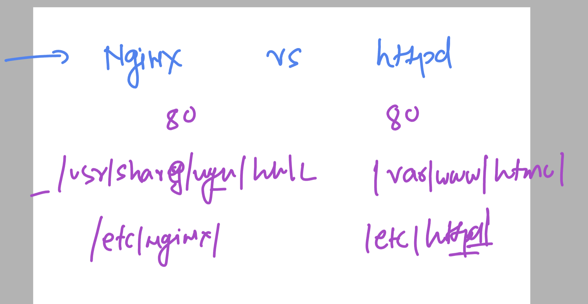

# linux-dotnet-vodafone

### Dotnet app with Loadbalancer case 

## we are having 2 server lets do the same thing in both server 

# server 1 

### Install dotnet and httpd -- RHEL 8/9 

```
 [ec2-user@server1 ~]$ pwd
/home/ec2-user
[ec2-user@server1 ~]$ sudo -i
[root@server1 ~]# whoami
root
[root@server1 ~]# cd  /opt/
[root@server1 opt]# ls
[root@server1 opt]# git clone https://github.com/redashu/ashu-customer1-app.git
Cloning into 'ashu-customer1-app'...
remote: Enumerating objects: 122, done.
remote: Counting objects: 100% (122/122), done.
remote: Compressing objects: 100% (78/78), done.
remote: Total 122 (delta 41), reused 108 (delta 35), pack-reused 0
Receiving objects: 100% (122/122), 863.23 KiB | 20.55 MiB/s, done.
Resolving deltas: 100% (41/41), done.
[root@server1 opt]# 


```

### checking app code 

```
[root@server1 sample-dotnetweb-app]# pwd
/opt/ashu-customer1-app/sample-dotnetweb-app
[root@server1 sample-dotnetweb-app]# ls
appsettings.Development.json  ashu-webapp.csproj  Models  Program.cs  README.md  wwwroot
appsettings.json              Controllers         obj     Properties  Views
[root@server1 sample-dotnetweb-app]# 


```

### Disable firewalld in local rhel server
```
sudo systemctl disable --now  firewalld
```

### how to check ports used by linux server

```
[root@server1 system]# netstat -nlpt
Active Internet connections (only servers)
Proto Recv-Q Send-Q Local Address           Foreign Address         State       PID/Program name    
tcp        0      0 127.0.0.1:81            0.0.0.0:*               LISTEN      669/ashu-webapp     
tcp        0      0 0.0.0.0:22              0.0.0.0:*               LISTEN      1032/sshd: /usr/sbi 
tcp        0      0 0.0.0.0:82              0.0.0.0:*               LISTEN      2624/ashu-webapp    
tcp6       0      0 ::1:81                  :::*                    LISTEN      669/ashu-webapp     
tcp6       0      0 :::22                   :::*                    LISTEN      1032/sshd: /usr/sbi 
tcp6       0      0 :::80                   :::*                    LISTEN      2322/httpd          
[root@server1 system]# 
[root@server1 system]# 
[root@server1 system]# ss -nlpt
State       Recv-Q      Send-Q           Local Address:Port           Peer Address:Port     Process                                      
LISTEN      0           512                  127.0.0.1:81                  0.0.0.0:*         users:(("ashu-webapp",pid=669,fd=266))      
LISTEN      0           128                    0.0.0.0:22                  0.0.0.0:*         users:(("sshd",pid=1032,fd=3))              
LISTEN      0           512                    0.0.0.0:82                  0.0.0.0:*         users:(("ashu-webapp",pid=2624,fd=266))     
LISTEN      0           512                      [::1]:81                     [::]:*         users:(("ashu-webapp",pid=669,fd=267))      
LISTEN      0           128                       [::]:22                     [::]:*         users:(("sshd",pid=1032,fd=4))              
LISTEN      0           511                          *:80                        *:*         users:(("httpd",pid=2326,fd=4),("httpd",pid=2325,fd=4),("httpd",pid=2324,fd=4),("httpd",pid=2322,fd=4))

```

### history 

```
1  hostnamectl set-hostname server2
    2   dnf install dotnet-sdk-8.0.x86_64   httpd -y
    3  ls
    4  dnf install git -y
    5  cd /opt/
    6  ls
    7  git clone https://github.com/redashu/ashu-customer1-app.git
    8  cd ashu-customer1-app/
    9  ls
   10  cd sample-dotnetweb-app/
   11  ls
   12  dotnet build
   13  dotnet publish
   14  vim /etc/systemd/system/ashuapp.service
   15  dnf install vim -y
   16  vim /etc/systemd/system/ashuapp.service
   17  systemctl start ashu-webapp.csproj 
   18  systemctl start ashu-webapp.service
   19  systemctl start ashuapp.service
   20  systemctl status ashuapp.service
   21  cd  /etc/httpd/conf.d/
   22  ls
   23  vim ashu.conf
   24  httpd -t
   25  systemctl restart httpd
   26  ls
   27  cat  ashu.conf 

```

### content in side ashuapp.service

```
[Unit]
Description=ashu ASP.NET Core Application

[Service]
WorkingDirectory=/opt/ashu-customer1-app/sample-dotnetweb-app/bin/Release/net8.0/publish/
ExecStart=/opt/ashu-customer1-app/sample-dotnetweb-app/bin/Release/net8.0/publish/ashu-webapp  --urls=http://localhost:81
Restart=always
RestartSec=10
SyslogIdentifier=your-app
User=root
Environment=ASPNETCORE_ENVIRONMENT=Production

[Install]
WantedBy=multi-user.target
```

### content ashu.conf

```
<virtualhost *:80>
#  we wanto run dotnet app using this vhost 
	servername vodafone1.delvex.io
	ProxyPass /  http://localhost:81/
	ProxyPassReverse / http://localhost:81/
	ErrorLog /var/log/httpd/ashuapp_error.log
 	CustomLog /var/log/httpd/ashuapp_access.log combined
</virtualhost>

```

### docker image to k8s 


### docker image -- 

### kubeclt checking 

```
[ashu@ip-172-31-87-20 ~]$ kubectl version --client 
Client Version: v1.29.0
Kustomize Version: v5.0.4-0.20230601165947-6ce0bf390ce3
```

### how to connect linux server with Kubernetes 


### test user configure 

```
[test@ip-172-31-87-20 ~]$ whoami
test
[test@ip-172-31-87-20 ~]$ pwd
/home/test
[test@ip-172-31-87-20 ~]$ mkdir  ~/.kube
[test@ip-172-31-87-20 ~]$ mkdir  ~/.oci
[test@ip-172-31-87-20 ~]$ pwd
/home/test
[test@ip-172-31-87-20 ~]$ ls -a
.  ..  .bash_logout  .bash_profile  .bashrc  .kube  .oci
[test@ip-172-31-87-20 ~]$ 


```

### copy config file in .kube folder

```
[test@ip-172-31-87-20 ~]$ cp -v  /tmp/k8s-cred/config   ~/.kube/config
‘/tmp/k8s-cred/config’ -> ‘/home/test/.kube/config’
[test@ip-172-31-87-20 ~]$ 
[test@ip-172-31-87-20 ~]$ 
[test@ip-172-31-87-20 ~]$ ls  -a .kube/
.  ..  config
[test@ip-172-31-87-20 ~]$ ls  -al .kube/
```

### doing this 

```
[test@ip-172-31-87-20 ~]$ kubectl  get nodes
WARNING: Permissions on /home/test/.oci/config are too open. 
To fix this please try executing the following command: 
oci setup repair-file-permissions --file /home/test/.oci/config 
Alternatively to hide this warning, you may set the environment variable, OCI_CLI_SUPPRESS_FILE_PERMISSIONS_WARNING: 
export OCI_CLI_SUPPRESS_FILE_PERMISSIONS_WARNING=True

WARNING: Permissions on /home/test/.oci/oci_api_key.pem are too open. 
To fix this please try executing the following command: 
oci setup repair-file-permissions --file /home/test/.oci/oci_api_key.pem 
Alternatively to hide this warning, you may set the environment variable, OCI_CLI_SUPPRESS_FILE_PERMISSIONS_WARNING: 
export OCI_CLI_SUPPRESS_FILE_PERMISSIONS_WARNING=True

NAME          STATUS   ROLES   AGE    VERSION
10.0.10.156   Ready    node    116m   v1.28.2
10.0.10.50    Ready    node    115m   v1.28.2
10.0.10.70    Ready    node    116m   v1.28.2
[test@ip-172-31-87-20 ~]$ 
[test@ip-172-31-87-20 ~]$ 
[test@ip-172-31-87-20 ~]$ chmod 600   /home/test/.oci/config 
[test@ip-172-31-87-20 ~]$ chmod 600   /home/test/.oci/oci_api_key.pem 
[test@ip-172-31-87-20 ~]$ 
[test@ip-172-31-87-20 ~]$ kubectl  get nodes
NAME          STATUS   ROLES   AGE    VERSION
10.0.10.156   Ready    node    117m   v1.28.2
10.0.10.50    Ready    node    117m   v1.28.2
10.0.10.70    Ready    node    117m   v1.28.2

```

### Deploy docker hub image to k8s 

```
[ashu@ip-172-31-87-20 ~]$ kubectl create  deployment  ashunodeapp  --image=dockerashu/ashudotnetapp:version10
deployment.apps/ashunodeapp created
[ashu@ip-172-31-87-20 ~]$ 
[ashu@ip-172-31-87-20 ~]$ kubectl get  deploy
NAME          READY   UP-TO-DATE   AVAILABLE   AGE
ashunodeapp   0/1     1            0           15s
[ashu@ip-172-31-87-20 ~]$ 
[ashu@ip-172-31-87-20 ~]$ kubectl get  deploy
NAME          READY   UP-TO-DATE   AVAILABLE   AGE
ashunodeapp   0/1     1            0           24s
[ashu@ip-172-31-87-20 ~]$ kubectl get po 
NAME                           READY   STATUS    RESTARTS   AGE
ashunodeapp-55f667ff76-8kq5t   1/1     Running   0          32s
[ashu@ip-172-31-87-20 ~]$ kubectl get  deploy
NAME          READY   UP-TO-DATE   AVAILABLE   AGE
ashunodeapp   1/1     1            1           37s
[ashu@ip-172-31-87-20 ~]$ 

```
### K8s specific commands 

```
49  kubectl  get  nodes
   50  kubectl get nodes
   51  kubectl create  deployment  ashunodeapp  --image=dockerashu/ashudotnetapp:version10
   52  kubectl get  deploy
   53  kubectl get po 
   54  kubectl get  deploy
   55  kubectl describe  deploy madhurinodeapp
   56  kubectl get  deploy
   57  kubectl delete deploy madhurinodeapp
   58  kubectl describe deploy poojanodeapp
   59  kubectl get pods
   60  kubectl describe pod poojanodeapp-5cf9d8c9b8-4pkgf
   61  kubectl get po 
   62  kubectl get nodes
   63  kubectl describe pod shaileshnodeapp-66b86b5d4-4xnj5
   64  kubectl run hello --image=nginx 
   65  kubectl get pods
   66  kubectl describe  pod hello
   67  kubectl get  deploy
   68  kubectl get  nodes
   69  kubectl  get pods
   70  kubectl  get pods  ashunodeapp-55f667ff76-8kq5t  -o wide
   71  kubectl describe  pod ashunodeapp-55f667ff76-8kq5t
   72  history 
[ashu@ip-172-31-87-20 ~]$ kubectl delete all --all
pod "anujapp-79db45cc97-kx5dd" deleted
pod "ashunodeapp-55f667ff76-8kq5t" deleted
pod "hello" deleted
pod "madhurinodeapp-ff749cdc-qpgtc" deleted
pod "poojanodeapp-5cf9d8c9b8-4pkgf" deleted
pod "shaileshnodeapp-66b86b5d4-4xnj5" deleted
pod "vijaydotnetapp-8496544c7b-9hddg" deleted
service "kubernetes" deleted
deployment.apps "anujapp" deleted
deployment.apps "ashunodeapp" deleted
deployment.apps "madhurinodeapp" deleted
deployment.apps "poojanodeapp" deleted

```

### k8s loadbalancer

```
[root@ip-172-31-87-20 ~]# kubectl get  deploy
NAME           READY   UP-TO-DATE   AVAILABLE   AGE
ashunodeapp1   1/1     1            1           8m47s
[root@ip-172-31-87-20 ~]# 
[root@ip-172-31-87-20 ~]# 
[root@ip-172-31-87-20 ~]# kubectl expose deploy ashunodeapp1  --type LoadBalancer --port 80 --target-port 5000 
service/ashunodeapp1 exposed
[root@ip-172-31-87-20 ~]# kubectl  get  svc
NAME           TYPE           CLUSTER-IP    EXTERNAL-IP   PORT(S)        AGE
ashunodeapp1   LoadBalancer   10.96.49.81   <pending>     80:30492/TCP   5s
kubernetes     ClusterIP      10.96.0.1     <none>        443/TCP        10m
[root@ip-172-31-87-20 ~]# kubectl  get  svc
NAME           TYPE           CLUSTER-IP    EXTERNAL-IP   PORT(S)        AGE
ashunodeapp1   LoadBalancer   10.96.49.81   <pending>     80:30492/TCP   22s
kubernetes     ClusterIP      10.96.0.1     <none>        443/TCP        10m
[root@ip-172-31-87-20 ~]# kubectl  get  svc
NAME           TYPE           CLUSTER-IP    EXTERNAL-IP     PORT(S)        AGE
ashunodeapp1   LoadBalancer   10.96.49.81   146.56.51.131   80:30492/TCP   42s
kubernetes     ClusterIP      10.96.0.1     <none>          443/TCP        10m
[root@ip-172-31-87-20 ~]# 


```


### set image to particular version

```
kubectl  set image deployment  ashunodeapp1  ashudotnetapp=dockerashu/ashudotnetapp:version15
```

### Nginx vs httpd 



### installing nginx web server

```

[root@ip-172-31-81-200 ~]# dnf install nginx 
Updating Subscription Management repositories.
Unable to read consumer identity

This system is not registered with an entitlement server. You can use subscription-manager to register.

Last metadata expiration check: 0:18:36 ago on Fri 05 Jan 2024 10:53:57 AM UTC.
Package nginx-1:1.20.1-14.el9_2.1.x86_64 is already installed.
Dependencies resolved.
Nothing to do.
Complete!
[root@ip-172-31-81-200 ~]# 
[root@ip-172-31-81-200 ~]# 
[root@ip-172-31-81-200 ~]# rpm -ql nginx
/usr/bin/nginx-upgrade
/usr/lib/systemd/system/nginx.service
/usr/share/man/man3/nginx.3pm.gz
/usr/share/man/man8/nginx-upgrade.8.gz
/usr/share/man/man8/nginx.8.gz
/usr/share/nginx/html/404.html
/usr/share/nginx/html/50x.html
/usr/share/nginx/html/icons
/usr/share/nginx/html/icons/poweredby.png
/usr/share/nginx/html/index.html
/usr/share/nginx/html/nginx-logo.png
/usr/share/nginx/html/poweredby.png
/usr/share/nginx/html/system_noindex_logo.png
/usr/share/vim/vimfiles/ftdetect/nginx.vim
/usr/share/vim/vimfiles/ftplugin/nginx.vim
/usr/share/vim/vimfiles/indent/nginx.vim
/usr/share/vim/vimfiles/syntax/nginx.vim
[root@ip-172-31-81-200 ~]# 

```

### default page

```
[root@ip-172-31-81-200 nginx]# cd  /etc/nginx/
[root@ip-172-31-81-200 nginx]# ls
conf.d     fastcgi.conf          fastcgi_params          koi-utf  mime.types          nginx.conf          scgi_params          uwsgi_params          win-utf
default.d  fastcgi.conf.default  fastcgi_params.default  koi-win  mime.types.default  nginx.conf.default  scgi_params.default  uwsgi_params.default
[root@ip-172-31-81-200 nginx]# vim nginx.conf
[root@ip-172-31-81-200 nginx]# 
[root@ip-172-31-81-200 nginx]# 
[root@ip-172-31-81-200 nginx]# cd  /usr/share/nginx/html/
[root@ip-172-31-81-200 html]# ls
404.html  50x.html  icons  index.html  nginx-logo.png  poweredby.png  system_noindex_logo.png
[root@ip-172-31-81-200 html]# 
[root@ip-172-31-81-200 html]# 
[root@ip-172-31-81-200 html]# systemctl start nginx
[root@ip-172-31-81-200 html]# systemctl status nginx
● nginx.service - The nginx HTTP and reverse proxy server
     Loaded: loaded (/usr/lib/systemd/system/nginx.service; disabled; preset: disabled)
     Active: active (running) since Fri 2024-01-05 11:15:09 UTC; 4s ago
    Process: 1303 ExecStartPre=/usr/bin/rm -f /run/nginx.pid (code=exited, status=0/SUCCESS)
    Process: 1304 ExecStartPre=/usr/sbin/nginx -t (code=exited, status=0/SUCCESS)
    Process: 1305 ExecStart=/usr/sbin/nginx (code=exited, status=0/SUCCESS)
   Main PID: 1306 (nginx)
      Tasks: 2 (limit: 11994)
     Memory: 1.9M
        CPU: 25ms
     CGroup: /system.slice/nginx.service
             ├─1306 "nginx: master process /usr/sbin/nginx"
             └─1307 "nginx: worker process"

Jan 05 11:15:09 ip-172-31-81-200.ec2.internal systemd[1]: Starting The nginx HTTP and reverse proxy server...
Jan 05 11:15:09 ip-172-31-81-200.ec2.internal nginx[1304]: nginx: the configuration file /etc/nginx/nginx.conf syntax is ok
Jan 05 11:15:09 ip-172-31-81-200.ec2.internal nginx[1304]: nginx: configuration file /etc/nginx/nginx.conf test is successful
Jan 05 11:15:09 ip-172-31-81-200.ec2.internal systemd[1]: Started The nginx HTTP and reverse proxy server.
[root@ip-172-31-81-200 html]# systemctl enable nginx
Created symlink /etc/systemd/system/multi-user.target.wants/nginx.service → /usr/lib/systemd/system/nginx.service.
[root@ip-172-31-81-200 html]# 

```

## Info about Angular 

```
[root@ip-172-31-81-200 ~]# cd  /opt/
[root@ip-172-31-81-200 opt]# ls
dotnetapp  sample
[root@ip-172-31-81-200 opt]# mkdir  ang-test
[root@ip-172-31-81-200 opt]# cd  ang-test/
[root@ip-172-31-81-200 ang-test]# ls
[root@ip-172-31-81-200 ang-test]# 
[root@ip-172-31-81-200 ang-test]# 
[root@ip-172-31-81-200 ang-test]# node -v
v20.10.0
[root@ip-172-31-81-200 ang-test]# history  | grep -i npm
  436  history  | grep -i npm
[root@ip-172-31-81-200 ang-test]# npm -v
10.2.3
[root@ip-172-31-81-200 ang-test]# ng version 

     _                      _                 ____ _     ___
    / \   _ __   __ _ _   _| | __ _ _ __     / ___| |   |_ _|
   / △ \ | '_ \ / _` | | | | |/ _` | '__|   | |   | |    | |
  / ___ \| | | | (_| | |_| | | (_| | |      | |___| |___ | |
 /_/   \_\_| |_|\__, |\__,_|_|\__,_|_|       \____|_____|___|
                |___/
    

Angular CLI: 17.0.9
Node: 20.10.0
Package Manager: npm 10.2.3
OS: linux x64

Angular: 
... 

Package                      Version
------------------------------------------------------
@angular-devkit/architect    0.1700.9 (cli-only)
@angular-devkit/core         17.0.9 (cli-only)
@angular-devkit/schematics   17.0.9 (cli-only)
@schematics/angular          17.0.9 (cli-only)

```

### Creating webui sample using ng

```
[root@ip-172-31-81-200 ang-test]# ng new ashu-ui-app
? Which stylesheet format would you like to use? CSS
? Do you want to enable Server-Side Rendering (SSR) and Static Site Generation (SSG/Prerendering)? No
CREATE ashu-ui-app/README.md (1063 bytes)
CREATE ashu-ui-app/.editorconfig (274 bytes)
CREATE ashu-ui-app/.gitignore (548 bytes)
CREATE ashu-ui-app/angular.json (2617 bytes)
CREATE ashu-ui-app/package.json (1042 bytes)
CREATE ashu-ui-app/tsconfig.json (903 bytes)
CREATE ashu-ui-app/tsconfig.app.json (263 bytes)
CREATE ashu-ui-app/tsconfig.spec.json (273 bytes)
CREATE ashu-ui-app/.vscode/extensions.json (130 bytes)
CREATE ashu-ui-app/.vscode/launch.json (470 bytes)
CREATE ashu-ui-app/.vscode/tasks.json (938 bytes)
CREATE ashu-ui-app/src/main.ts (250 bytes)
CREATE ashu-ui-app/src/favicon.ico (15086 bytes)
CREATE ashu-ui-app/src/index.html (295 bytes)
CREATE ashu-ui-app/src/styles.css (80 bytes)
CREATE ashu-ui-app/src/app/app.component.css (0 bytes)
CREATE ashu-ui-app/src/app/app.component.html (20884 bytes)
CREATE ashu-ui-app/src/app/app.component.spec.ts (931 bytes)
CREATE ashu-ui-app/src/app/app.component.ts (369 bytes)
CREATE ashu-ui-app/src/app/app.config.ts (227 bytes)
CREATE ashu-ui-app/src/app/app.routes.ts (77 bytes)
CREATE ashu-ui-app/src/assets/.gitkeep (0 bytes)
✔ Packages installed successfully.
hint: Using 'master' as the name for the initial branch. This default branch name
hint: is subject to change. To configure the initial branch name to use in all
hint: of your new repositories, which will suppress this warning, call:
hint: 
hint: 	git config --global init.defaultBranch <name>
hint: 
hint: Names commonly chosen instead of 'master' are 'main', 'trunk' and
hint: 'development'. The just-created branch can be renamed via this command:
hint: 
hint: 	git branch -m <name>
    Successfully initialized git.

```

### we can either build or serve it 

### note: if we want apache or Nginx to host app then build it else ng serve

### build

```
[root@ip-172-31-81-200 ashu-ui-app]# ls
angular.json  node_modules  package.json  package-lock.json  README.md  src  tsconfig.app.json  tsconfig.json  tsconfig.spec.json
[root@ip-172-31-81-200 ashu-ui-app]# ng build

Initial Chunk Files   | Names         |  Raw Size | Estimated Transfer Size
main-K3ZRKFU7.js      | main          | 192.23 kB |                52.68 kB
polyfills-LZBJRJJE.js | polyfills     |  32.69 kB |                10.59 kB
styles-5INURTSO.css   | styles        |   0 bytes |                 0 bytes

                      | Initial Total | 224.93 kB |                63.28 kB

Application bundle generation complete. [17.772 seconds]
[root@ip-172-31-81-200 ashu-ui-app]# ls
angular.json  dist  node_modules  package.json  package-lock.json  README.md  src  tsconfig.app.json  tsconfig.json  tsconfig.spec.json
[root@ip-172-31-81-200 ashu-ui-app]# ls dist/
ashu-ui-app
[root@ip-172-31-81-200 ashu-ui-app]# ls dist/ashu-ui-app/
3rdpartylicenses.txt  browser
[root@ip-172-31-81-200 ashu-ui-app]# ls dist/ashu-ui-app/browser/
favicon.ico  index.html  main-K3ZRKFU7.js  polyfills-LZBJRJJE.js  styles-5INURTSO.css
[root@ip-172-31-81-200 ashu-ui-app]# 


```

### hosting angular app

```
 477  ng new ashu-ui
  478  ls
  479  ng new anuj-app
  480  ls
  481  cd  ashu-ui/
  482  ls
  483  ng build
  484  ls
  485  ls dist/ashu-ui/browser/
  486  cp -rf  dist/ashu-ui/browser/    /var/www/html/ashu
  487  cd ../anuj-app/
  488  ls
  489  ng build
  490  ls
  491  cp -rf dist/anuj-app/browser/  /var/www/html/anuj
  492  history 
  493  systemctl start httpd
  494  setenforce 0
  495  cd /var/www/html/
  496  ls
  497  rm -rf index.html  favicon.ico  main-K3ZRKFU7.js  polyfills-LZBJRJJE.js  styles-5INURTSO.css 
  498  systemctl restart httpd
  499  ls -l
  500  ls ashu/
  501  ls -l
  502  ls ashu/
  503  ls ashu/ -l
  504  cd  /etc/httpd/conf.d/
  505  ls
  506  touch anuj.conf
  507  touch ashu.conf
  508  ls
  509  cd /var/www/html/
  510  ls
  511  cp -rf ashu/* .

```

